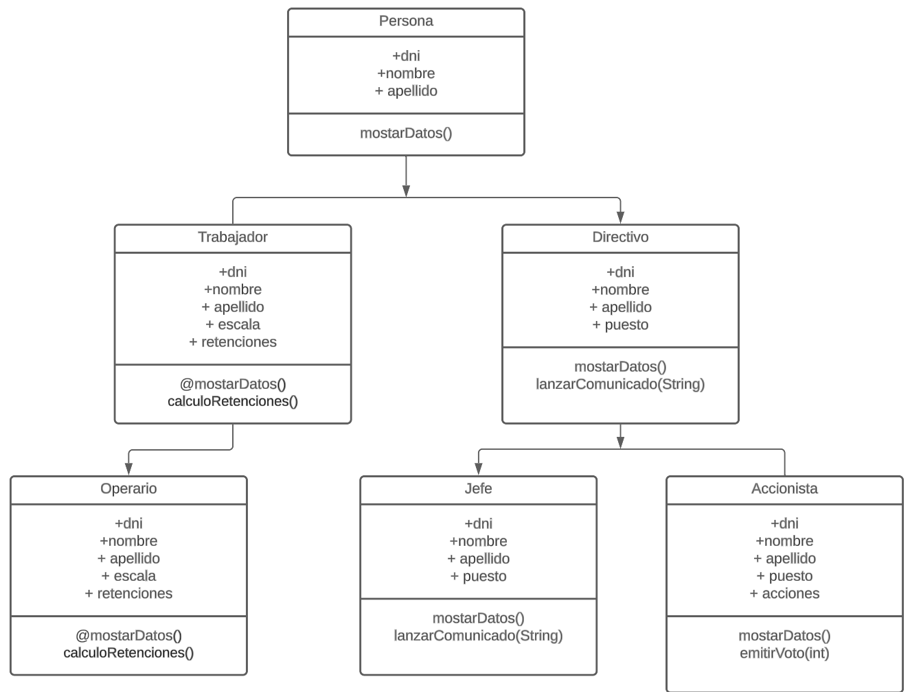

# Índice

- [Índice](#índice)
- [tipos de datos](#tipos-de-datos)
- [Variables](#variables)
- [Funciones](#funciones)
- [Listas](#listas)
  - [Listas dinámicos](#listas-dinámicos)
  - [Maps](#maps)
- [Clases](#clases)
- [Herencia](#herencia)
- [Mixins](#mixins)
- [Asincronía - Future](#asincronía---future)
  - [Future](#future)
  - [Async y Await](#async-y-await)

Flutter se base en un lenguaje de programación llamado Dart desarrollado por Google. Se trata de un lenguaje de ejecucion y codificación rápida, que mezcla características de muchos de los lenguajes de programación existentes a día de hoy

Antes de empezar con la sintaxis del lenguaje, comentar que al igual que otros lenguajes de programación, flutter cuenta con un metodo main sobre el cual comienza todas las ejecuciones

```dart
void main() {
    print('Hola Mundo');
}
```

Dicho método puede o no tener parámetros de entrada

# tipos de datos

- Numéricos: int y double
- Booleanos
- String
- Dinámicos: dynamic, Object
- Listas: List, Set, Map
- Future: se verá más adelante

Para poder definir una variable, esta puede incluir o no el tipado del mismo

```dart
var anyos = 20;
var edad = 10;
```

# Variables

Existen dos grandes tipos de variables en dart en cuanto a su creación: variables que mutables y no mutables. Las variables mutables son aquellas que pueden cambiar su valor a lo largo de la ejecución y para definirlas se utiliza la palabra reservada var. Una cosa importante a tener en cuenta es que si definimos una variable con un tipo concreto, ya no podremos utilizar la declaración como var, ya que su tipo le acompañará en toda la vida de la variable.

```dart
var nombre = "Borja"
```

Las variables no mutables son aquellas que no cambian en ningún momento. Existen dos tipos, cuya diferencia es el momento en el que se crean

- const: inicializado en compilación
- final: inicializado en ejecución

```dart
const PI = 3.141516;
final DNI = "02543293E";
```

Una de las diferencias más significativas es que una variable declarada como final puede ser mutada en su interior, como por ejemplo una lista.

```dart
final lista = ["uno","dos","tres"];
lista.add("valor nuevo");
print(lista[3]); // valor nuevo
```

Sin embargo si queremos hacer lo mismo con una variable de tipo const, saltaría una excepción

Otras de las características que tiene el lenguaje de programación es el uso de valores por defecto o null safety conocido en otros lenguajes como Kotlin. Para poder utilizar esta características se utiliza el sigo de ? después del tipo de la variable, para indicar que no tiene un valor asignado.

```dart
int? edad;
```

En estos casos, el valor asignado a esta variable es de null. Al igual que se puede indicar que la variable puede tener un valor de null, en algunos casos es necesario indicar que dicho valor no va a ser null sino que podemos garantizar que hay un valor guardado, para lo que se utiliza el el carácter !

```dart
List? lenguajes;
void main() {
  var edad = 2;
  lenguajes = ["Dart", "Java", "Kotlin", "Python"];
  print(lenguajes.length);
}
```

Esto daría error de compilación ya que se reconoce que la lista de datos tiene un posible valor de null. Para evitar estos fallos es necesario indicar que la variable lenguajes tiene valor

```dart
print(lenguajes!.length);
```

Otro de los modificadores que se utilizan en la declaración de variables es el de late. Imaginemos una variable que en un futuro tendrá valor, pero que no queremos que de primeras está inicializada. Aquí es donde entra el operador late

```dart
late var listado;
void main() {

  listado = [];
  print(listado);

}
```

**_??: se indica el valor que tendrá la variable en el caso de que sea nula_**

# Funciones

Las funciones representan el las parte de código reutilizables que son ejecutadas con la llamada de la misma. Para poder definir una función se utiliza la siguiente sintaxis:

```dart
void nombreFuncion(){

}
```

Donde void es el tipo de retorno que tendrá. Del mismo modo, las funciones pueden admitir parámetros los cuales pueden ser llamados de muy diferentes formas

- Parámetros normales

```dart
void main() {
    registrarUsuario("Borja", "Informática")
}

void registrarUsuario(nombre, departamento){
  print('El usuario con nombre $nombre, ha quedado registrado en el departamento $departamento');
}
```

- Parámetros optativos

```dart

void registrarUsuario(nombre, departamento, [salario=0]){
  print('El usuario con nombre $nombre, ha quedado registrado en el departamento $departamento');
  if (salario!=0){
    print('Con un salario asignado de $salario');
  }
}
```

En ambos casos los parámetros se pueden tipar, para así forzar al compilador a que se asigna un valor de tipo concreto

- Parámetros nominales

En vez de pasar los parámetros por posición, se pueden pasar mediante nombres. En este caso se engloban entre {}

```dart
void main() {

    registrarUsuario(nombre: "Borja",departamento: "Informática", salario: 100);

}

void registrarUsuario({required nombre, required departamento, salario}){
  print('El usuario con nombre $nombre, ha quedado registrado en el departamento $departamento');
  if (salario!=0){
    print('Con un salario asignado de $salario');
  }
}
```

# Listas

## Listas dinámicos

El tipo es List y se puede inicializar mediante []. En el caso de querer manipular datos, se utilizan los siguientes métodos:

- add
- removeAt
- remove

En el caso de querer recorrer una lista se puede hacer bien por un foreach o bien por un for tradicional

```dart
  for(var i=0; i<nombres.length;i++){
    print('Posición $i => valor ${nombres[i]}');
  }
```

Tambien es posible utilizar el operador iterator

```dart
  var iter = nombres.iterator;
  while(iter.moveNext()){
    print('El elemento de la lista: ${iter.current}');
  }
```

## Maps

El tipo correspondiente es Map y se puede incializar mediante {}. Se trata de un conjunto de datos que guarda un par clave - valor.

```dart
 Map<String,dynamic> usuario = {
    'nombre' : 'Borja',
    'apellidp' : "Herrera",
    'edad' : 28,
    'departamento' : "informática"
  };
```

En el caso de querer acceder a los valores asignados a una key, se realiza mediante la posición

```dart
print(usuario['nombre']) // Borja
```

Los mapas son dinámicos, por lo que se pueden agregar elementos sobre la variable. Para ello se utiliza el método addAll

```dart
usuario.addAll({'saladio' : 1500, 'puesto' : 'programadro'}); // Añadimos dos entradas
```

En el caso de querer recorrer todos los elementos de un mapa se utilizan los métodos value y entries

```dart
diccionarioUsuarios.keys.forEach((element)=>print(element));
diccionarioUsuarios.keys.forEach((element)=>print(element));
```

# Clases

A la hora de trabajar con clases, como todo lenguaje programado a objetos, una clase representa el molde de un tipo. Para crear una clase basta con utilizar la palabra reservada class y el nombre que le queramos dar.

```dart
class Usuario {
  var nombre;
  var apellido;
  var telefono;
}
```

En el caso de querer declarar alguna de ellas como privada para que no sean visibles desde fuera del paquete, tendremos que marcarla como \_

```dart
class Usuario {
  var _dni
  var nombre;
  var apellido;
  var telefono;
}
```

Para poder utilizar un objeto de forma correcta, es necesario utilizar un constructor. Hay varios tipos de constructores:

- Constructor de clase

Se trata del constructor "normal", donde se indican los parámetros que deben ser pasados y estos se igualan a cada una de las propiedades

```dart
class Usuario {
  var _dni;
  var nombre;
  var apellido;
  var telefono;

    Usuario(String nombre, String apellido, int telefono){
        this.nombre = nombre;
        this.apellido = apellido;
        this.telefono = telefono;
    }

}
```

Una vez declarado el constructor, ya se podría crear un objeto con dichos datos.

```dart
void registrar({nombre, apellido}) {
  var usuario = new Usuario("Borja", "Martin", 1234);
  print(usuario.nombre);
  print(usuario.apellido);
  print(usuario.telefono);
}
```

De la misma forma se podrían crear constructores con parémetros nominales

```dart
Usuario(String nombre, String apellido, int telefono, {required dni}) {
    this.nombre = nombre;
    this.apellido = apellido;
    this.telefono = telefono;
    _dni = 123;
  }
```

y llamarlo de la siguiente forma:

```dart
new Usuario(dni: 123,"Borja", "Martin", 1234)
```

Es muy importante tener en cuenta que una vez se crea un constructor de clase, no se puede crear otro de la misma forma. También es importante tener en cuenta que en los ejemplos mostrados se ha pasado por parámetros el tipo que se requiere, pero esto no es obligatorios

```dart
  Usuario( nombre,  apellido, telefono, {required dni}) {
    this.nombre = nombre;
    this.apellido = apellido;
    this.telefono = telefono;
    _dni = 123;
  }
```

- Constructores resumido:

Otra de las formas de crear un constructor es inicializar directamente cada una de las propiedades de la clase. Para ello, además de existir cada una de las propiedades como variables de clase, se creará un constructor con la siguiente forma:

```dart
class Usuario {
  var _dni;
  var nombre;
  var apellido;
  var telefono;

  Usuario(this.nombre, this.telefono, this.apellido);
}
```

Con este tipo de constructor, se permitirá el siguiente código

```dart
var usuario = new Usuario("Borja", "Martin", 1234);
```

En el caso de querer utilizar parámetros nominales en el constructor ser utilizaría la siguiente forma de construir:

```dart
class Usuario {
  var _dni;
  var nombre;
  var apellido;
  var telefono;

  Usuario({this.nombre, this.telefono, this.apellido});
}
```

Con este nuevo constructor, la inicialización de antes ya no sería correcta, sino que tendría que ser la siguiente:

```dart
var usuario = new Usuario(nombre: "Borja", apellido: "Martin", telefono: 1234);
```

Por supuesto, en cualquiera de los casos se pueden poner valores por defecto y/o valores requeridos

```dart
Usuario({this.nombre, this.telefono, this.apellido = 0000, required this.correo});
```

Como se ha comentado antes, este tipo de constructores no puede coincidir en código con los vistos en el punto anterior.

- Constructores nominales

Además de los dos tipos de constructores que hemos visto en los puntos anteriores, existe una tercera posibilidad de crear un objeto. Con los vistos hasta este momento, es imposible tener más de un constructor. Para ello se puede crear un constructor siempre y cuando se cree de forma nominal, utilizándolo como si fuese un método más, de la siguiente forma

```dart
class Usuario {
  var _dni;
  var nombre;
  var apellido;
  var telefono;
  var correo;

  Usuario({this.nombre, this.telefono, this.apellido = 0000, required this.correo});
  Usuario.sinApellido(this.nombre, this.telefono, this.correo);
  Usuario.sinCorreo(this.nombre, this.telefono, this.apellido);
}
```

Con el código anterior, tendriamos la posibilidad de crear un objeto de tres diferentes formas:

```dart
  var usuario1 = new Usuario(correo: "borja@correo.es",nombre: "borja",apellido: "Martin");
  var usuario2 = new Usuario.sinCorreo("borja",123, "Martin");
  var usuario3 = new Usuario.sinApellido("borja",123, "borja@correo.com");
```

Uno de los métodos más importantes y utilizados dentro de las clases son los getter y setter. Estos métodos proveen de acceso y modificacion de las variables de las clase, los cuales pueden ser privados (colocando un \_ antes de la definción de la variable). En el caso de querer accederlas, es necesario utilizar los métodos getter y setter, los cuales se acceden como si fuesen una variabe, aunque son métodos

```dart

void main() {

  var usuario1 = new Usuario("Borja", "Martin", 39);
  var usuario2 = Usuario.fromParametros("Borja", "Martin", 39, 30000);

  usuario1.nombre = "ejemplo";
  print(usuario1.nombre);


}

class Usuario{

  String _nombre;
  String _apellido;
  int _edad;
  int? _salario;

  Usuario(this._nombre, this._apellido, this._edad);
  Usuario.fromParametros(String nombre, String apellido, int edad, int salario):
  this._nombre = nombre, this._apellido = apellido, this._edad = edad, this._salario = salario;


  void set nombre(String nombre){
    this._nombre = nombre;
  }

  String get nombre{
    return this._nombre;
  }

}
```

# Herencia

Para poder trabajar con la herencia, se utiliza la palabra reservada extends. Para este ejemplo vamos a utilizar una clase llamada Usuario que será la base de las siguientes clases. Dicha clase tendrá las características de nombre apellido y dni

```dart
main() {
  var usuario = Usuario(nombre: "Borja", apellido: "Martin", dni: "123123");
  var usuario2 = Usuario.sinDni("Borja", "Martin");
  usuario.mostrarDatos();
  usuario2.mostrarDatos();
}

class Usuario {
  var dni;
  var nombre;
  var apellido;

  Usuario({this.nombre, this.apellido, this.dni});
  Usuario.sinApellido(this.nombre, this.dni);
  Usuario.sinDni(this.nombre, this.apellido);

  void mostrarDatos() {
    print("Nombre: $nombre");

    if (this.apellido.length > 0) print("Apellido: $apellido");
    if (this.dni.toString().length > 0) print("DNI: $dni");
  }
}

```

Una vez tenemos clase base, el siguiente paso es crear una clase que extienda de ella y capture todos los elementos que se quieran para utilizarlos o modificarlos. Para poder hacer esto se utiliza la palabra reservada extends

```dart
class Trabajador extends Usuario {
  var NSS;

  Trabajador(this.NSS, String nombre, String apellido, String dni)
      : super(nombre: nombre, apellido: apellido, dni: dni);
}
```

Como se puede ver en el ejemplo, en el caso de tener variables adicionales es necesario identificarlas dentro del constructor. Sin embargo aquellas que sean heredadas de la clase deben se agregan mediante el super utilizando alguno de los consturctores de la superclase.

En el caso de querer modificar el comportamiento de alguno de los métodos, es necesario sobreescribirlos utilizando el decorador @Override.

```dart
class Trabajador extends Usuario {
  var NSS;

  Trabajador(this.NSS, String nombre, String apellido, String dni)
      : super(nombre: nombre, apellido: apellido, dni: dni);

  @override
  void mostrarDatos() {
    super.mostrarDatos();
    print("NSS: $NSS");
  }
}
```

# Mixins

Los mixins es una técnica que permite a los elementos de Dart obtener una herencia múltiple. Imaginemos que tenemos una serie de clases como: Persona, Trabajador, Directivo, Consultor, Vendedor, Operario, Jefe. Todas estas clases se podrían representar en un diagrama de herecia con el siguiente:

- Persona (clase)
  - Trabajador (clase)
    - Vendedor
    - Operario (clase)
  - Directivo (clase)
    - Jefe (clase)
    - Vendedor

Esta clasificacione de clases se podría hacer en todos los lenguajes de programación, teniendo en cuenta que hay una de las clases que ha extendido tanto de trabajador como de Directivo. En este caso estaríamos hablando de una herencia múltiple, lo que por dfecto no está permi está permitido. Es aquí donde se aplican los mixins. El diagrama de clases con herencia simple quedaría de la siguiente forma

```dart
import 'dart:io';

abstract class Persona {
  var dni;
  var nombre;
  var apellido;

  Persona({this.nombre, this.apellido, this.dni});
  Persona.sinApellido(this.nombre, this.dni);
  Persona.sinDni(this.nombre, this.apellido);

  void mostrarDatos() {
    print("Nombre: $nombre");

    if (this.apellido.length > 0) print("Apellido: $apellido");
    if (this.dni.toString().length > 0) print("DNI: $dni");
  }
}

abstract class Trabajador extends Persona {
  var NSS;
  var escala;
  var retenciones;
  Trabajador(this.NSS, this.escala, String nombre, String apellido, String dni)
      : super(nombre: nombre, apellido: apellido, dni: dni);

  @override
  void mostrarDatos() {
    super.mostrarDatos();
    print("NSS: $NSS");
    print("NSS: $escala");
    print("NSS: $retenciones");
  }

  void calculoRetenciones() {
    switch (escala) {
      case 'A':
        escala = 0.2;
        break;
      case 'B':
        escala = 0.3;
        break;
      case 'C':
        escala = 0.4;
        break;
      default:
        escala = 0.1;
    }
  }
}

abstract class Directivo extends Persona {
  var puesto;

  Directivo(this.puesto, String nombre, String apellido, String dni)
      : super(nombre: nombre, apellido: apellido, dni: dni);

  @override
  void mostrarDatos() {
    super.mostrarDatos();
    print("Puesto: $puesto");
  }

  void lanzarComunicado(String comunicado) {
    print("Estimados trabajadores se comunica que \n$comunicado");
  }
}

class Operario extends Trabajador {
  var salario;
  var pagas;

  Operario(super.NSS, super.escala, super.nombre, super.apellido, super.dni,
      this.salario, this.pagas);

  @override
  void mostrarDatos() {
    super.mostrarDatos();
    print("Salario: $salario");
    print("Pagas: $salario");
  }

  void calculoSalario() {
    int salarioMes = salario / pagas;
    print("El salario mensual es: $salarioMes");
  }
}

class Jefe extends Directivo {
  var participaciones;

  Jefe(
      super.NSS, super.nombre, super.apellido, super.dni, this.participaciones);

  @override
  void mostrarDatos() {
    super.mostrarDatos();
    print("Participaciones: $participaciones");
  }

  void realizarEntrevista(Trabajador trabajador) {
    print("Proceso de entrevista al trabajador ${trabajador.nombre} realizado");
  }
}

class Accionista extends Directivo {
  var acciones;

  Accionista(super.NSS, super.nombre, super.apellido, super.dni, this.acciones);

  @override
  void mostrarDatos() {
    super.mostrarDatos();
    print("Acciones: $acciones");
  }

  void emitirVoto(int valoracion) {
    print("Se procede al voto con unas participaciones de $acciones");
    print("Voto emitido: $valoracion");
  }
}

```

El diagrama de clases quedaría de la siguiente forma



En este ejemplo tenemos como clases principales Persona la cual actúa como super clase de Trabajador y Directivo. Todas estas clases están marcadas como abstractas para que no puedan ser utilizadas para crear un objeto. Ambas clases además de hererad los métodos de persona, se especializan con la creación de métodos como son calculoRetenciones y emitir comunicado respectivamente

Al mismo tiempo, las clases Operario y Jefe son clases finales, donde cada una de ellas tienen métodos individuales. La clase Operario además de extender de la clase Trabajador y tener sus métodos, tiene un método adicional que permite calcular el salario mensual, mientras que la clase Jefe tiene un método que permite realizar entrevista a un trabajador.

Creamos una serie de objetos el código quedaría de la siguiente forma

```dart
main() async {
  Jefe jefe = new Jefe(123, "Borja", "Martin", "1234A", 30);
  Accionista accionista = new Accionista(123, "Borja", "Martin", "1234A", 200);
  Operario operario =
      new Operario(123, "Junior", "Luis", "Gómez", "1234A", 30000, 12);

  accionista.emitirVoto(10);
  accionista
      .lanzarComunicado("Este es un comunicado lanzado por un accionista");

  jefe.lanzarComunicado("Este es un comunicado lanzado por el jefe");
  jefe.realizarEntrevista(operario);

  operario.calculoSalario();
  operario.calculoRetenciones();
}
```

Como se puede ver, cada uno de los objetos puede realizar sus métodos correspondientes. Pero ahora supngamos que tanto un objeto de tipo Operio como un objeto de tipo Jefe deben poder hacer la misma tarea. Según la linea de herencia que se ha marcado no podría incorporarse dicho método en la clase Persona ya que todos los objetos lo tendrían, y lo mismo pasaría con la clase Trabajador y la clase Directivo. Para poder cumplir con estos requisitos estan los mixins, los cuales son clases abstractas que tan solo tienen la difinición de un método para que todas aquellas clases que las quieran utilizar puedan hacerlo pese a tener una extensión ya hecha. Para el ejemplo, vamos a suponer que tanto el operario como el jefe pueden realizar la tarea de ejecutarCierre. Para ello crearemos una clase como la siguiente:

```dart
class Cierre {
  void ejecutarCierre() {
    print("Se procede a ejecutar el cierre del ejercicio");
  }
}
```

Una vez creada la clase que será el mixin, para utilizarlo tan solo sería necesario indicarlo en la clase donde se quiera utilizar, como en Operario y Jefe de nuestro ejemplo

```dart
class Operario extends Trabajador with Cierre {

}

class Jefe extends Directivo with Cierre {

}
```

A partir de este momento, todos los objetos de tipo Operario y Jefe podrán utiizar sus mñetodos pero también el del mixins

```dart
jefe.ejecutarCierre();
operario.ejecutarCierre();
```

# Asincronía - Future

En muchos casos, es necesario realizar peticiones que no se sabe muy bien cuando van a terminar. En estos casos no se puede realizar un trabajo desde el hilo principal ya que sino se podrñía bloquear la aplicación al ser una ejecucion en el mismo hilo que otras. En estos casos lo que se utiliza es la asincronía, la cual permite realizar tareas que no se sabe muy bien cuando van a terminar, y en el momento que lo hagan se ejecute aquellas cosas que queremos. Esta asincronía se basan en los tipos Future, utilizando los operadores async y await

## Future

Un elemento de tipo future es aque que realiza una ejecución pero que tendrá un resultado en un momento de tiempo no determinado. La sintaxis de los objetos de tipo future es la siguiente:

```dart
new Future<tipo_resultante>(funcion que se ejecutará)
```

Dicha sintaxis marca que dentro de la función de un objeto future, se pondrán aquellas tareas que se quieren ejecutar con un resultado indefinido en tiempo, siempre obteniendo un return (resultado que se obtendrá en tiempo)

```dart
new Future(() => {"Resultado de la tarea"});
```

Una vez el future sea lanzado, es necesario obtener su reultado para lo cual se utiliza la función then, la cual obtiene el resultado que se ha indicado en el futuro

```dart
new Future(() => "Resultado de la tarea").then((value) => print(value));
// en este caso value tendra el valor de "Resultado de la tarea"
```

En este caso el future lo estamos ejecutando directamente desde el main, pero podríamos realizar un registro de usuario en una función y que retornase un future

```dart
Future<String> registrarUsuario(Usuario usuario) {
  // se ha creado un Future con un delay de 4 segundo para comprobar la asincronía
  return Future.delayed(new Duration(seconds: 4),
      () => "Usuario ${usuario.nombre} registrado correctamente");
}

main() {
  print("iniciada tarea");

  print("inicio de registro de usuarios");
  registrarUsuario(new Usuario.sinDni("nombre", "apellido"))
      .then((value) => {print(value)})
      .catchError((onError) => {print("Error")});
}
```

Un ejemplo típico de ejecuciones asíncronas es la de consular con una página web para obtener el JSON asociado o la respuesta concreta, el cual veremos más adelante.

## Async y Await

Como ya se ha visto, un future vale para poder hacer ejecuciones de código asíncrono lo que indica que la tarea se ejecutará al mismo tiempo que otras. Además de utilizar el tipo Future, Dart incorpora las palabras reservadas Async y Await para mejorar el mecanismo de asincronía. Ambas palabras van de la mano, ya que una indica (async) que la funcion es asincrona y la otra (await) indica que un elemento debe esperar al resultado de una llamada (un future). Veamos un ejemplo

```dart
Future<String> realizaTarea() {
  return new Future(() => "Tarea realizada");
}

main() {
  realizaTarea().then((value) => print(value));
}
```

El método retorna un future para el cual tiene que ser obtenido desde un then cuando se llama al método. Sin embargo con el uso de los elementos async y await la tarea se simplifica. PAra ello lo primero que se aplica es la definición de await, la cual indica que se debe esperar a la resulución de un objeto future y de forma obligatoria el método donde se declare un await debe ser async

```dart
Future<String> realizaTarea() async {

  var resultado = await new Future(() => "Tarea realizada");
  return resultado;
}
```

Una vez hecho esto, desde el main ya podríamos obtener el resultado directamente siempre y cuando le indiquemos al main que también es async

```dart
Future<String> realizaTarea() async {
  var resultado = await new Future(() => "Tarea realizada");
  return resultado;
}

main() async {
  print(await realizaTarea());
}
```
