# Índice

- [Índice](#índice)
- [Bases de flutter. Los widgets](#bases-de-flutter-los-widgets)
- [Primer proyecto Flutter](#primer-proyecto-flutter)
- [Widgets](#widgets)
  - [Widgets de colocación](#widgets-de-colocación)
    - [Center](#center)
    - [Container](#container)
    - [Row - Column](#row---column)
      - [Row](#row)
      - [Column](#column)
        - [Convinación](#convinación)
    - [Tabla](#tabla)
  - [Widgets gráficos](#widgets-gráficos)
    - [Botones](#botones)
      - [Normal Button](#normal-button)
      - [Icon Button](#icon-button)
      - [Acciones](#acciones)
      - [Segmented Button](#segmented-button)
        - [Acciones](#acciones-1)
      - [FloatingActionButton (FBA)](#floatingactionbutton-fba)
    - [Radio Button](#radio-button)
    - [CheckBox](#checkbox)
    - [TextInput](#textinput)
      - [Acciones](#acciones-2)

# Bases de flutter. Los widgets

Para poder entender un proyecto Flutter, lo primero que hay que hablar es de la composición de una aplicación. Hay un concepto básico en flutter que todo gira alrededor de el, que son los widgets. Se dice que en flutter todos son widgets y en realidad es así. Un widget es cada elemento que se puede ver dentro de la pantalla, desde el elemento más simple (una etiqueta de texto) hasta la propia pantalla. Depende de cual sea el cometido del mismo más adelante veremos que hay widgets con estado y sin estado. Explicado esto, una aplicación de flutter es un arbol de widgets, los cuales combinados forman una aplicación funcional

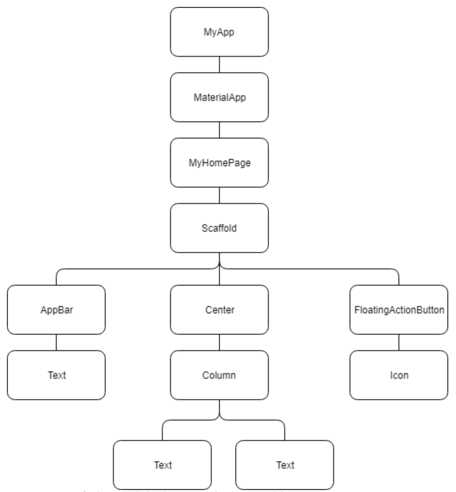

Como se puede ver en la imagen todo parte de un elemento llamado MyApp, terminar en los widgets finales de texto e icono. En esta jerarquía, podemos diferencia entre widgets finales (aquellos que representan un elemento como texto o icono) y widgets contenedores (aquellos que tienen otros wodgets dentro). Esta diferenciación es sobre elementos gráficos, pero en cuanto a funcionalidad existen dos tipos de widgets:

- Stateless: aquellos widgets que no tienen estado, es decir que tan solo se utilizan para mostrar información y no recogerla y/o guardarla para tratarla de alguna forma

- Statefull: aquellos widgets que si tienen estado, por lo que pueden recoger información y guardarla para procesarla. Para ello este tipo de widgets tienen un método especial llamado setState() que modifica esta condición.

En cuanto a rendimiento, el uso de statefull es mucho más pesado ya que cada vez que cambia el estdo de la aplicación se debe recargar internamente, por lo que se recomienda en la medida de lo posible utilizar stateless

Antes de empezar a crear un proyecto, vamos a ver parte de código y en concreto vamos a explicar la creación de un widget. Lo primero que tenemos que saber es que los widgets se pueden representar o bien por clases o bien como objetos que ya están creados (flutter cuenta con una grán cantidad de widgets que se pueden consultar en el siguiente enlace ). Como mínimo tendremos una clase, la cual extenderá o bien de statefull o stateless

```dart
class MyApp extends StatelessWidget {
  const MyApp({super.key});

  // This widget is the root of your application.
  @override
  Widget build(BuildContext context) {
    return MaterialApp(
      title: 'Flutter Demo',
      theme: ThemeData(
        primarySwatch: Colors.blue,
      ),
      home: const MyHomePage(title: 'Flutter Demo Home Page'),
    );
  }
}
```

En este ejemplo podemos que ver el widget principal el de tipo stateless. Todo widget tienen un método llamado build que admite un contexto y que retorna un widget. Este retorno es un widget ya creado llamdo MaterialApp, el cual tiene como parémtros en el constructor (nominales) un title, un theme y un home (que a su vez es otro widget). MaterialApp es el widget básico creado por Flutter para utilizar elementos de tipo máterial (podemos ver todos en este <a href="https://docs.flutter.dev/ui/widgets/material?gclid=Cj0KCQjwpPKiBhDvARIsACn-gzAn8r2pjhRCK9lIB0JMKytrCxZwRNd1e6sLD9cLcluL3cWnmKWKcTgaAklBEALw_wcB&gclsrc=aw.ds">link</a>)

El siguiente paso sería crear la clase llamada MyHomePage, la cual está situada en el home. Dicha clase será otro widget representado con el siguiente código

```dart
class MyHomePage extends StatelessWidget {
  const MyHomePage({super.key, required this.title});

  final String title;

  @override
  Widget build(BuildContext context) {
    return Scaffold(
      appBar: AppBar(title: Text(title)),
      floatingActionButton:
          FloatingActionButton(onPressed: () {}, child: const Icon(Icons.comment)),
      body: const Center(child: Text("Primera app en Flutter"),),
    );
  }
}
```

La clase extiendo de stateless widget por lo que no puede guardar estado. En este caso el widget retornado es un Scaffold, el cual representa el contenedor (a diferencia de MaterialApp que representa la pantalla) del resto de widgets. Como se puede ver, los elementos que se pasan en contructor son: appbar, floatingactionbutton y body.

En el caso de querer poner en el centro elementos que se quieran utilizar para algo, es ncesario utilizar un statefull widget, el cual tendría la siguiente clase asociada

```dart
class FormState extends StatefulWidget{
  @override
  State<StatefulWidget> createState() {
    return _FormWidgetState
  }
}

class _FormWidgetState extends State<FormWidgetState> {
  String name = "";
  int number = 0;
}
```

Siempre que se crea un widget StateFull, hay que tener dos clases:

- Una primera clase que extiende de StatefulWidget, la cual representa el widget completo. Este clase tienen que sobreescribir el método createState para retornar un estado
- Una sendunta clase que extiende de State con el tipado de la clase creada en el punto anterior para que se pueda crear un estado. Esta clase actua como los widgets sin estado, sobreescribiendo el método build el cual retorna un widget. La particularidad de esta clase es que tienen un método setState que permite cambiar el valor de alguna de las variables que forman parte de la clase

```dart
class _FormWidgetState extends State<FormState> {
  final nameController = TextEditingController();
  final numberController = TextEditingController();

  String _name = "";
  int _number = 0;

  _changeState() {
    setState(() {
      _name = nameController.text;
      _number = int.parse(numberController.text);
    });
  }
  _validateData(BuildContext context){
    ScaffoldMessenger.of(context).showSnackBar(
      SnackBar(
        content: Text("Nombre: $_name $_number")
      ),
    );
  }

  @override
  Widget build(BuildContext context) {
    // TODO: implement build
    return Container(
        padding: EdgeInsets.all(20),
        child: Column(children: [
          TextField(
            controller: nameController,
            decoration: const InputDecoration(
              border: OutlineInputBorder(),
              labelText: 'Introduce tu nombre',
            ),
          ),
          Padding(padding: EdgeInsets.fromLTRB(0, 10, 0, 10)),
          TextField(
            controller: numberController,
            decoration: const InputDecoration(
              border: OutlineInputBorder(),
              labelText: 'Introduce un número del 1 al 10',
            ),
          ),
          ElevatedButton(
              onPressed: () => {_changeState()},
              child: Text("Pulsar para añadir")),
          ElevatedButton(
              onPressed: () => {_validateData(context)},
              child: Text("Pulsar para validar")),
        ]));
  }
}
```

Una vez se tiene todo este código generado, el último paso para poder crearlo todo es lanzar la aplicación. Para ello se utiliza el método main, sobre el cual se ejecuta el método runApp pasando como parámetros un objeto de tipo widget.

```dart
void main() {
  runApp(const MyApp());
}
```

Más adelante detallaremos el uso de cada uno de los elementos dentro de la aplicación, pero a modo introductorio es posible que en alguna de las constucciones de elementos veamos tanto elementos con const o sin el. Esto dependerá de la posibilidad de ponerlo (si los widgets que hay dentro nunca cambian es muy recomendable ponerlo). También, veremos que a la hora de crear un widgets, los constructores que se utilizan son nominales, siempre incluyendo en ellos un key

```dart
  const MyHomePage({super.key, required this.title});
```

# Primer proyecto Flutter

Como ya se ha comentado en los puntos anteriores, para poder desarrollar un proyecto flutter existen principalmente dos IDEs: Android Studio y Visual Studio Code. Ambor requieren de extensiones o plugin. En nuestro caso optaremos por utilizar Android Studio ya que para poder utilizar Flutter es necesaria su intalación, así como la creación de un dispositivo virtual para la emulación

A la hora de crear un proyecto desde Android Studio, basta con seguir el asistente que ofrece el IDE como se puede ver en las siguientes imagenes

|                  Selección SDK                  |              Selección plataformas              |
| :---------------------------------------------: | :---------------------------------------------: |
| 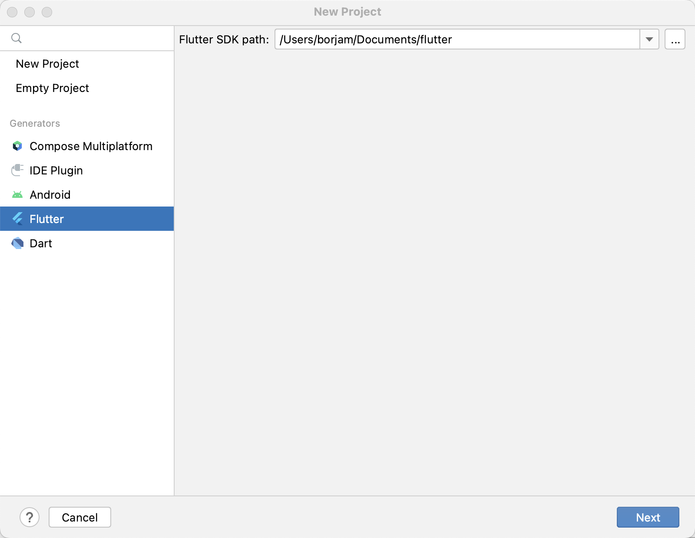 | 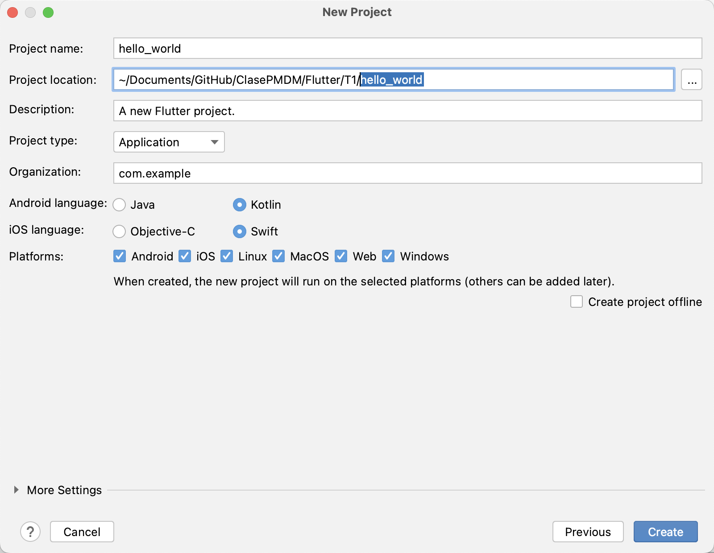 |

En el primer paso, es necesario indicar cual es el la ruta donde está ubicado el sdk de dart. En el segundo paso además de indicar el nombre del proyecto y la ruta donde se va a guardar, es necesairo indicar cuales son las plataformas para las que se va a realizar el desarrollo. Recordemos que flutter permite un desarrollo crossplatform, siendo el código común para todas las plataformas. Podremos seleccionar ios, android, linux, windows, macos y web. Una vez se ha creado el proyecto se generan una serie de carpetas, cada una de las cuales tiene el código correspondiente a la plataforma determinada. En especial hay una que es con la que vamos a trabajar de momento y es la carepta lib. En esta carpeta se ubica el código común a todas las plataformas por lo que será compilado para cada una de ellas. Por defecto, se incluye un fichero llamado main.dart. Para poder entender mejor el código, vamos a explicar paso a paso en contenido del fichero.

1. Lo primero que nos encontramos es el método mail(). Al igual que en java, dicho método es el punto de entrada de la aplicación y será ejecutado tras darle al play en el IDE. Dentro de este método se ejecuta el método runApp, el cual arranca la llamada a la aplicación flutter

```dart
void main() {
  runApp(const MyApp());
}
```

Como parámetro del método runApp hay que dar un objeto de tipo Widget. Por defecto hay uno creado, estando representado por una clase que exitende de StatelessWidget o de StatefullWidget

2. Creación del Widget principal de la aplicación. Hay que recordad que tal y como se ha comentado en puntos anteriores, en flutter todos los elementos que se ven en la pantalla son widgets, incluso la propia pantalla. Precisamente este widget es el acargado de montar el escenario donde se albergarán el resto de componentes (de tipo MaterialApp). Para su creación, podría ser desde un fichero externo (previa importación) o directamente en una clase declarada dentro del mismo fichero

```dart
class MyApp extends StatelessWidget{
  @override
  Widget build(BuildContext context) {
    //TODO: implement build
    throw UnimplementedError();
  }
}
```

Esta es la sintaxis básica, donde se extiende de StatelessWidget y por lo tanto se sobreescribe el método build que será en encargado de devolver el widget a pintar (MaterialApp en nuestro caso)

```dart
class MyApp extends StatelessWidget {
  const MyApp({super.key});

  @override
  Widget build(BuildContext context) {
    //TODO: implement build
    return MaterialApp(
      title: "Hello World",
      theme: ThemeData(primaryColor: Colors.blueGrey),
      home: Center(),
    );
  }
}
```

Se ha incorporado un constructor (para poder llamar al widget desde cualquier parte) donde como parámetro principal pune un super.key, obtenido desde la superclase. Este código permitirá acceder más adelante al componente. El retorno del método build lo que se está indicando es que el método build retorna un widget de tipo MaterialApp con las características de title (título que aparecerá en la parte superior), theme (esquema de colores) y el atributo home (que representa el widget principal que se mostrará nada más arrancar la aplicación). En es código se pueden ver solo tres atributos pero se puede ver todo es el siguiente <a href="https://api.flutter.dev/flutter/material/MaterialApp-class.html" target="_black" >link</a>. En el caso del home, en el ejemplo se ha puesto un widget por defecto (Center) pero lo normal es que esté configurado por un wodget que represente una pantalla completa. Para ello vamos a crear un nuevo fichero donde poder crear una pantalla con sus configuraciones.

```dart
class HomePage extends StatelessWidget{

  const HomePage({super.key, required this.title});
  final String title;

  @override
  Widget build(BuildContext context) {
    // TODO: implement build
    return Scaffold();
  }
}
```

En este caso, para poder construir el widget HomePage es necesario pasar además del key que lo da la superclase, un String que se guardará en la variable title (en este ejemplo se ha querido pasar este dato, pero podría ser cualquiera). El método build retorna un widget que en este caso es un scaffold. El scaffold es un contenedor que representa la estructura básica de una aplicación Material donde aparece la parte superior AppBar, la parte central o body y un boton flotante. El código quedaría de la siguiente forma:

```dart
  @override
  Widget build(BuildContext context) {
    // TODO: implement build
    return Scaffold(
      appBar: AppBar(title: Text(title)),
      floatingActionButton: FloatingActionButton(onPressed: () => {}, child: const Icon(Icons.add)),
      body: Center(),
    );
  }
```

**\* Para poder ver todos los atributos del Scaffold pulsar el siguiente <a href="https://api.flutter.dev/flutter/material/Scaffold-class.html" target="_black" >link</a> \***

En este caso, se han configurado tres atributos del scaffold:

- appBar: representa la parte superior. Este barra tiene configurado un texto, por lo que es necesario incluirlo dentro de un wodget de tipo Text, donde se pasa como parámetro la variable title
- floatingActionButton: representa un botón ubicado por defecto en la parte inferior derecha. De forma obligatoria hay que sobreescribír el atributo onPressed, el cual indica la función que se ejecutará cuando el botón sea pulsado. En el caso de querer ponerle un icono habrá que realizarlo de la misma forma que en el appBar, anidando un Widget en el atributo child.
- home: representa la parte central de la pantalla. En esta parte central se suele poner un contenedor que permita incluir varios elementos de forma ordenada. Para este ejemplo vamos a siguar un texto en el centro de la pantalla

```dart
Widget build(BuildContext context) {
    // TODO: implement build
    return Scaffold(
      appBar: AppBar(title: Text(title)),
      floatingActionButton: FloatingActionButton(onPressed: () => {}, child: const Icon(Icons.add)),
      body: const Center(child: Text("Hellow World")),
    );
  }
```

El body se ha configurado con un contenedor Center, el cual tiene un atributo child donde se indica cual es el hijo que tiene dentro. En este caso se ha configurado un widget Text.

El árbol de widget de esta primera aplicación quedaría de la siguiente forma

[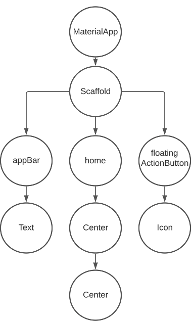]

# Widgets

Una vez se ha entendido la creación del proyecto y la forma en la que se estructura la aplicación, es momento de hablar de los diferentes tipos de widgets. Antes de empezar con la definción de los tipos, recordemos que existen dos grandes tipos de widgets: stateless y statefull. Ámbos se diferencian en la capacidad de mantener tener datos para que sean utiliados. A lo largo de esta sección veremos como utilizar ámbos tipos

Para empezar a ver los principales widgets que existe, haremos diferenciación entre los elementos gráficos (aquellos que tienen una GUI) y elementos de colocación (aquellos que sirven como contenedores de otros widgets y los colocan de una forma determinada). Para todos los ejemplos se va a partir de la aplicaión realizada en el punto anterior, representando dentro del body del scaffold los elementos a mostrar

## Widgets de colocación

Como se ha dicho antes, los wodgets de colocación son aquellos que tienen la capacidad de contener otros widgets y colocarlos de tal forma que queden en una disposicion concreta. Una cosa muy importante es que todos ellos se pueden anidar entre sí, pero para explicarlo de forma más sencilla vamos a utilizarlos de forma indifidualizada. Para todos los ejemplos nos vamos a utilizar como base un MaterialApp con un scaffold con el siguiente código

```dart
Widget build(BuildContext context) {
    // TODO: implement build
    return Scaffold(
      appBar: AppBar(title: Text(title)),
      floatingActionButton: FloatingActionButton(onPressed: () => {}, child: const Icon(Icons.add)),
      body:
    );
  }
```

### Center

Se trata del layout más sencillo. Como su propio nombre indica, se encarga de centrar el elemento que tiene marcado como hijo. En el caso de no indicar un ancho y alto, ocupará todo el espacio posible

```dart
body: const Center(child: Text("Hellow World"),heightFactor: 20.0, widthFactor: 40.0),

// ó

body: const Center(child: Text("Hellow World")),
```

Como se puede ver en el código, este widget tiene un atributo que es el de child que indica cual es el elemento que se centrará

### Container

Se trata de un widget parecido al anterior, pero con la capacidad de personalizar mucho más el aspecto y posiciones que tendrán todos los componentes que se metan dentro. En el caso de querer poner un texto dentro de un contenedor quedaría de la siguiente forma:

```dart
      body: Container(
        padding: const EdgeInsets.all(20.0),
        color: Colors.amber,
        child: const Text("Contenedor principal"),
        alignment: Alignment.center,
        width: 200.0,
        height: 200.0,
      ),
```

Con las características configuradas, la colocacion del texto quedaría de la siguiente forma

[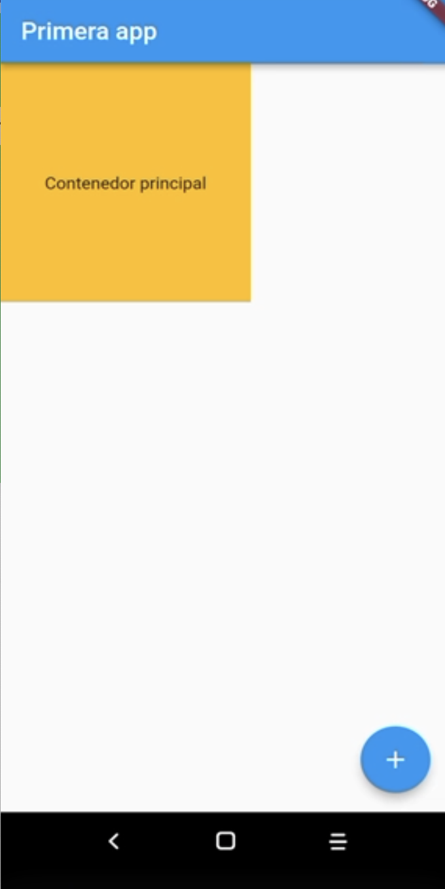]

Dentro de las características mostradas, además de las que son sencillas de interpretar, existe la de aligment la cual marcará en que posición se pone el child indicado. En el caso de no configurar las características de width y heigth el tamaño que tendrá el widget será el máximo posible, siendo en este caso la apariencia la siguiente

[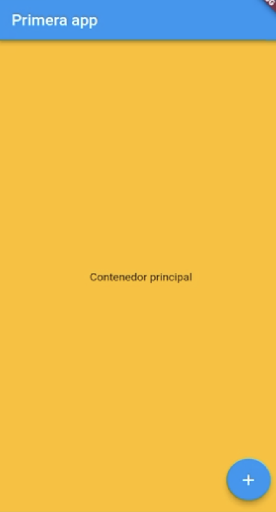]

### Row - Column

En los dos casos anteriores para poder indicar un elemento dentro del layout tan solo podíamos incluir uno al tener una característica llamada child (en singular). En el caso de querer incluir más de un elemento estos no valdrían ya que no tienen esa capacidad y aquí es donde entrar el resto de widgets. El primero de ellos que ofrece dicha capacidad son las row - col. Se trata de una distribución en filas y columnas (o ámbas) las cuales tienen un atributo llamado childs (plural).

#### Row

Se trata de un elemento fila que agrupa widgets en su interior horizontalmente (mainAxis)

```dart
      body: Row(
        children: [
          Text("Texto en posicion 1"),
          Icon(Icons.access_alarm),
          Text("Texto en posicion 2"),
          Expanded(
              child: Image.network("https://upload.wikimedia.org/wikipedia/commons/thumb/4/44/Google-flutter-logo.svg/2560px-Google-flutter-logo.svg.png"))
        ],

      ),
```

En el caso de querer centrar la fila para que aparezca en la parte central de la pantalla, se tendrán que agregar las siguientes características:

```dart
mainAxisAlignment: MainAxisAlignment.center,
//Center Row contents horizontally,
crossAxisAlignment: CrossAxisAlignment.center
//Center Row contents vertically,,
```

#### Column

Se trata de un elemento columna que agrupa widgets en su interior verticalmente (mainAxis)

```dart
body: Column(
          children: [
            Text("Texto en posicion 1"),
            Icon(Icons.access_alarm),
            Text("Texto en posicion 2"),
            Expanded(
                child: Image.network(
                    "https://upload.wikimedia.org/wikipedia/commons/thumb/4/44/Google-flutter-logo.svg/2560px-Google-flutter-logo.svg.png"))
          ]
      ),
```

En el caso de querer centrar la columna para que aparezca en la parte central de la pantalla, se tendrán que agregar las siguientes características:

```dart
mainAxisAlignment: MainAxisAlignment.center,
//Center Row contents horizontally,
crossAxisAlignment: CrossAxisAlignment.center
//Center Row contents vertically,,
```

##### Combinación

Tal y como se ha explicado antes, se pueden utilizar los elementos de forma individual o también juntarlos. En el siguiente ejemplo se va a realizar la UI de un formulario que junte diferentes row , col

Para empezar, marcamos como elemento principal un column y dentro del mismo un row

```dart
body: Column(
        children: [
          Row(
            children: const [
              Text("Nombre"),
              Padding(padding: EdgeInsets.only(right: 10.0)),
              Expanded(
                  child: TextField(
                decoration: InputDecoration(
                    border: OutlineInputBorder(),
                    hintText: 'por favor introduce tu nombre'),
              ))
            ],
          )
        ],
      ),
```

Si continuamos agregando rows, con elentos dentro, o simplemente elementos tendríamos un código como el siguiente

```dart
body: Column(
        children: [
          Row(
            children: const [
              Text("Nombre"),
              Padding(padding: EdgeInsets.only(right: 10.0)),
              Expanded(
                  child: TextField(
                decoration: InputDecoration(
                    border: OutlineInputBorder(),
                    hintText: 'por favor introduce tu nombre'),
              ))
            ],
          ),
          Row(
            children: const [
              Text("Apellido"),
              Padding(padding: EdgeInsets.only(right: 10.0)),
              Expanded(
                  child: TextField(
                decoration: InputDecoration(
                    border: OutlineInputBorder(),
                    hintText: 'por favor introduce tu apellido'),
              )),
            ],
          ),
          Expanded(
              child: TextField(
            decoration: InputDecoration(
                border: OutlineInputBorder(),
                hintText: 'por favor introduce tu correo'),
          ))
        ],
      ),
```

Con el siguiente resultado

[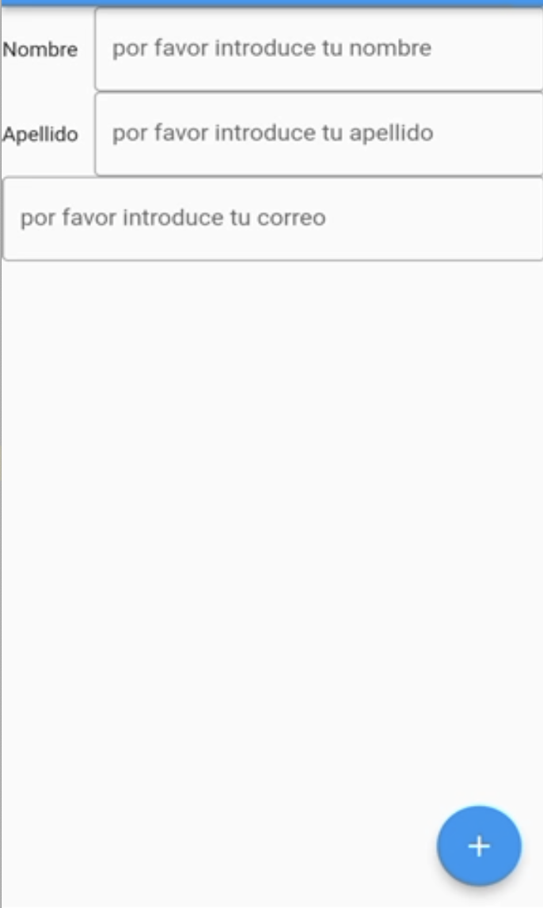]

Antes de continuar con el siguiente layout, es importante reseñar el uso del Expanded. No es obligatorio su uso, pero en el caso de hacerlo, aquel elemento que está incluido dentro tendrá la capacidad de ajustarse al espacio donde está puesto. Por ejemplo, si tenemos un row con todos los elementos puestos como expanded, en un móvil todos los elementos se acomplarán al espacio que tienen disponible pero si se visualiza en un navegador pasará exactamente lo mismo por lo que se verá mejor.

### Tabla

Como se ha visto en el ejemplo anterior, mediante la unión de filas y columnas se pueden crear cualquier tipo de layout que queramos. Sin embargo en muchas ocasiones esto puede suponer bastante lio sobre todo a la hora de hacer la estructura de los elementos. Es por eso que cuando queremos organizar un layout en un formato estructurado podemos utilizar una tabla como solución. Una tabla está compuesta por childres, los cuales representan tantos TableRow como sean necesarios, y estos a su vez tienen childer que representan cada una de las columnas. El códulo de una tabla con botones sería el siguiente

```dart
body: Table(
          children: [
            TableRow(children: [
              ElevatedButton(onPressed: () {}, child: Text("Boton 1.1")),
              ElevatedButton(onPressed: () {}, child: Text("Boton 1.2")),
              ElevatedButton(onPressed: () {}, child: Text("Boton 1.3"))
          ]),
            TableRow(children: [
              ElevatedButton(onPressed: () {}, child: Text("Boton 2.1")),
              ElevatedButton(onPressed: () {}, child: Text("Boton 2.2")),
              ElevatedButton(onPressed: () {}, child: Text("Boton 2.3"))
            ]),
            TableRow(children: [
              ElevatedButton(onPressed: () {}, child: Text("Boton 3.1")),
              ElevatedButton(onPressed: () {}, child: Text("Boton 3.2")),
              ElevatedButton(onPressed: () {}, child: Text("Boton 3.3"))
            ])
          ],
        )
```

Con el siguiente resultado

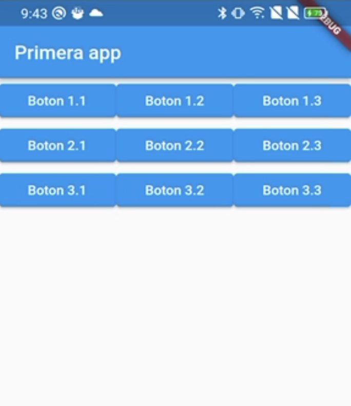

Como se puede ver aparecen tantas filas - columnas como se hayan indicado, pero sin aprovechar el espacho en alto (en ancho hay que tener en cuenta que todas las filas tienen que tener el mísmo número de columnas). Alguna de las características adicionales de este widgets son las siguientes:

- defaultColumnWidth: indica cual será el ancho por defecto de las columnas.
- defaultVerticalAlignment indica cual será la alineación interna de las columnas.

```dart
defaultVerticalAlignment: TableCellVerticalAlignment.middle,
defaultColumnWidth: FractionColumnWidth(0.3),
```

## Widgets gráficos

Una vez se han visto los principales elementos de colocación, vamos a pasar a ver los elementos que tienen un aspecto gráfico reconocible en UI. Ya se han utilizado muchos de ellos para poder incorporarlos dentro de los layout, pero en esta sección vamos a verlos en detalle. Durante toda esta seccion vamos a utilizar un proyecto donde cada página (widget que extiende de Stateless) contendrá cada uno de los elementos que se van a estudiar. Por lo que el proyecto base tendrá el siguiente código:

```dart
class ButtonPage extends StatelessWidget {
  const ButtonPage({super.key, required this.title});

  final String title;

  @override
  Widget build(BuildContext context) {
    return Scaffold(
        appBar: AppBar(title: Text(title)),
        body: Column(
          crossAxisAlignment: CrossAxisAlignment.center,
          children: [],
        ));
  }
}
```

El primer tipo de elemento que veremos son los botones

### Botones

Los botones son los elementos típicos de UI que permiten interaccion con el usuario, ya que permite a este seleccionar o lanzar acciones con su pulsación.

#### Normal Button

Existen multitud de botones, entre los que descatan los siguientes, ElevatedButton, FilledButton, FilledButton.tonal, OutlinedButton, TextButton. El código de cada uno de ellos sería el siguiente

```dart
class ButtonPage extends StatelessWidget {
  const ButtonPage({super.key, required this.title});

  final String title;

  @override
  Widget build(BuildContext context) {
    return Scaffold(
        appBar: AppBar(title: Text(title)),
        body: Padding(
            padding: EdgeInsets.all(20.0),
            child: Center(
              child: Column(
                crossAxisAlignment: CrossAxisAlignment.center,
                mainAxisAlignment: MainAxisAlignment.center,
                children: [
                  ElevatedButton(
                      onPressed: () {}, child: const Text("Elevated")),
                  FilledButton(onPressed: () {}, child: Text("Filled")),
                  OutlinedButton(onPressed: () {}, child: Text("Outliner")),
                  TextButton(onPressed: () {}, child: Text("Text")),
                ],
              ),
            )));
  }
}
```

La construccion de todos ellos es bastante sencilla, lo única diferencia como tal por defecto es el aspecto gráfico. El resultado es el siguiente:

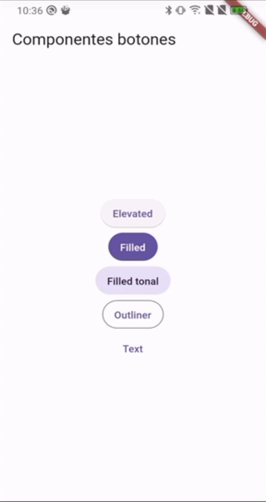

Como se puede comprobar todos los botones tienen la misma función onPressed (la cual trataremos ahora). En el caso de querer incoporar un icono a cada uno de los botones se podría hacer indicandolo en la creación del botón

```dart
ElevatedButton.icon(
onPressed: () {},
label: Text("Elevated icon"),
icon: Icon(Icons.add)),
```

#### Icon Button

En el caso de querer utilizar solo botones que tengan icono (y no label) se tendría que utilizar la clase IconButton

```dart
IconButton(
onPressed: () {}, icon: const Icon(Icons.access_alarms))
```

De la misma forma que a los botones normales se les piede indicar la posibilidad de icono indicando el .icon, al contrario pasa exáctamente lo mismo, pudiendo indicar el aspecto que tienen cada uno de los botones con icono de la siguiente forma

```dart
Column(
                      children: [
                        IconButton(
                            icon: const Icon(Icons.filter_drama),
                            onPressed: () {}),

                        // Filled icon button
                        IconButton.filled(
                            onPressed: () {},
                            icon: const Icon(Icons.filter_drama)),

                        // Filled tonal icon button
                        IconButton.filledTonal(
                            onPressed: () {},
                            icon: const Icon(Icons.filter_drama)),

                        // Outlined icon button
                        IconButton.outlined(
                            onPressed: () {},
                            icon: const Icon(Icons.filter_drama)),
                      ],
                    )
```

Si juntamos los dos tipos de botones que hemos visto dentro de una fila tendríamos el siguiente código

```dart
class ButtonPage extends StatelessWidget {
  const ButtonPage({super.key, required this.title});

  final String title;

  @override
  Widget build(BuildContext context) {
    return Scaffold(
        appBar: AppBar(title: Text(title)),
        body: Padding(
            padding: const EdgeInsets.all(20.0),
            child: Center(
                child: Column(
              children: [
                Row(
                  crossAxisAlignment: CrossAxisAlignment.center,
                  mainAxisAlignment: MainAxisAlignment.center,
                  children: [
                    Column(
                      children: [
                        ElevatedButton(
                            onPressed: () {}, child: Text("Elevated")),
                        ElevatedButton.icon(
                          onPressed: () {},
                          label: const Text("Elevated icon"),
                          icon: const Icon(Icons.add),
                        ),
                        FilledButton(
                            onPressed: () {}, child: const Text("Filled")),
                        OutlinedButton(
                            onPressed: () {}, child: const Text("Outliner")),
                        TextButton(onPressed: () {}, child: const Text("Text")),
                      ],
                    ),
                    const Padding(
                        padding: EdgeInsets.only(left: 5.0, right: 5.0)),
                    Column(
                      children: [
                        IconButton(
                            icon: const Icon(Icons.filter_drama),
                            onPressed: () {}),

                        IconButton.filled(
                            onPressed: () {},
                            icon: const Icon(Icons.filter_drama)),

                        IconButton.filledTonal(
                            onPressed: () {},
                            icon: const Icon(Icons.filter_drama)),

                        IconButton.outlined(
                            onPressed: () {},
                            icon: const Icon(Icons.filter_drama)),
                      ],
                    )
                  ],
                ),
                Row()
              ],
            ))));
  }
}
```

Con el siguiente resultado

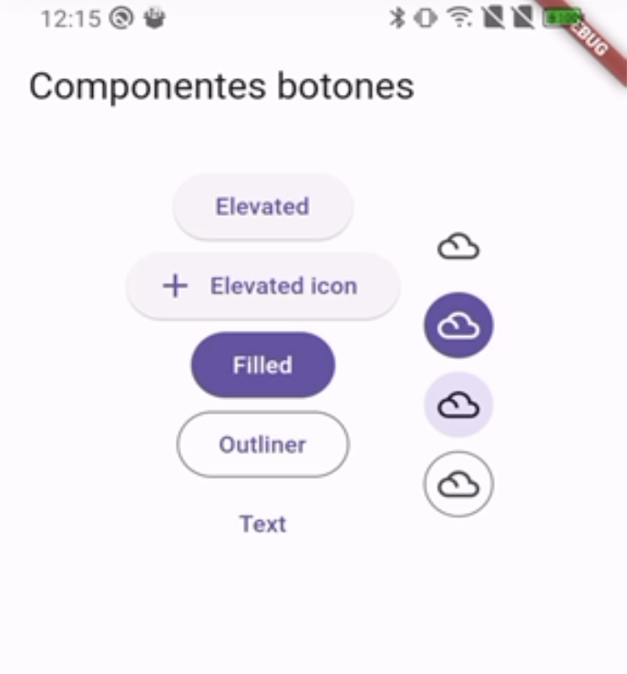

#### Acciones

Para poder gestionar la pulsación de los botones, existe la obligación de sobreescribir el metodo onPressed de la clase Button. Este atributo va asociado a una función, la cual se ejecutará al producirse la acción concreta

```dart
ElevatedButton(
onPressed: () {print('Pulsado botón elevado');}, child: Text("Elevated")),
```

De la misma forma, se puede realizar una función que reciba por parámetros el mensaje que se quiere mostrar para que dicha función se pueda llamar desde la pulsación del botón. La función quedaría de la siguiente forma

```dart
  void sendMessage(String text, BuildContext context){
    ScaffoldMessenger.of(context)
        .showSnackBar( SnackBar(
      content: Text(text),
      duration: const Duration(seconds: 1),
    ));
  }
```

y la llamada a la misma desde la pulsación de un botón quedaría así:

```dart
IconButton(
icon: const Icon(Icons.filter_drama),
onPressed: () {
sendMessage("Boton pulsado icono normal", context);},),
```

No solo se puede evaluar la pulsación del botón, sino también por ejemplo la pulsación larga, mediante el método onLongPress

```dart
ElevatedButton(
  onPressed: () {
    print('Pulsado botón elevado');
  },
  onLongPress: () {
    sendMessage("Pulsación larga...", context);
  })
```

En este punto podemos hacer un pequeño inciso sobre los diferentes tipos de widgets que existen. Imaginemos que nos interesa saber si el botón está pulsado o no para poder, por ejemplo aplicarle un tema u otro o simplemente actuar ante ese estado. Para ello no podríamos hacerlo con un wodget normal ya que no podemos persistir datos, tendríamos que hacerlo con un statefull widget. En los siguientes puntos haremos ejemplos con estos elementos para poedr ver la funcionalidad completa.

#### Segmented Button

Otra de las posibilidades que ofrece material3 es la de utiliza botones segmentados, es decir, aquellos que limitan las opciones de pulsación. El ejemplo más tipico de este tipo de botones es un grupo de opciones (por ejemplo la talla de una camiseta, un lenguaje de programación entre una lista de disponibles) donde tan solo una puede ser seleccionada. Para ello lo primero con lo que debemos contar es un con objeto de tipo enum donde se guardarñan todas las posibilidades que queremos representar dentro de la lista de botones

```dart
enum lenguage { Dart, Kotlin, Java, JavaScript, TypeScript }
```

Una vez contamos con la lista de opciones, el siguiente paso es crear el elemento. Para ello se utiliza el constructor pasando como parámetros obligatorios una lista de segmented button tipada con la lista creada anteriormente, un elemento selected que será el que aparecerá seleccionado por defecto, el resto de parámetros son optativos

```dart
  Widget buildSegmentedButtons() {
    return SegmentedButton(
        segments: <ButtonSegment<lenguage>>[
          ButtonSegment(value: lenguage.Dart, label: Text(lenguage.Dart.name)),
          ButtonSegment(value: lenguage.Java, label: Text(lenguage.Java.name)),
          ButtonSegment(
              value: lenguage.Kotlin, label: Text(lenguage.Kotlin.name)),
          ButtonSegment(value: lenguage.JavaScript, label: Text("Js"))
        ],
        selected: <lenguage>{lenguage.Dart},
        onSelectionChanged: (Set<lenguage> newSelection) {
          print(newSelection.first.name);
        });
  }
```

Como se puede ver, ademas de indicar cuales son los elementos que se quieren mostrar dentro de la lista de botones, también se indica cual es el elemento que está seleccionado (en este caso el lenguaje Dart). Esto puede suponer un problema, ya que cuando cambia la seleccion no se realiza una actualización de quien es el elemento seleccionado, sino que aunque se realice una selección diferente seguiré estando seleccionado el mismo. Para poder hacer el cambio es necesario jugar con el estado del grupo de botones (a continuación veremos como hacerlo). Por último podemos ver en el código la propiedad onSelectionChanged, la cual tiene asignada una funcion de flecha que retorna un parámetro de tipo Set con la selección. En este caso lo que se realiza es una impresión por consola del elemento que está seleccionado.

En el caso de querer que se puedan seleccionar varias opciones al mismo tiempo, sería necesario indicar dentro del objeto dicha posibilidad con la siguiente característica

```dart
multiSelectionEnabled: true,
```

##### Acciones

Como se acaba de contar, las acciones de un SegmentedButton son sencillas ya que tan solo es necesario asociar la característica onSelectionChanged con su funcion de flecha asociada. Sin embargo si se quiere mantener el elemento seleccionado o simplemente se quiere sacar esa selección para utilizarla en cualquier lado, es necesario gestionar su estado. Para ello tenemos que crear un widget con dicho estado como el siguiente:

```dart
class SegmentedButtonComplete extends StatefulWidget {
  @override
  State<StatefulWidget> createState() {
    return _SegmentedButtonState();
  }
}

class _SegmentedButtonState extends State<SegmentedButtonComplete> {
  lenguage selected = lenguage.Dart;

  @override
  Widget build(BuildContext context) {
    return SegmentedButton(
        segments: <ButtonSegment<lenguage>>[
          ButtonSegment(value: lenguage.Dart, label: Text(lenguage.Dart.name)),
          ButtonSegment(value: lenguage.Java, label: Text(lenguage.Java.name)),
          ButtonSegment(
              value: lenguage.Kotlin, label: Text(lenguage.Kotlin.name)),
          ButtonSegment(value: lenguage.JavaScript, label: Text("Js"))
        ],
        selected: <lenguage>{
          selected
        },
        onSelectionChanged: (Set<lenguage> newSelection) {
          setState(() {
            selected = newSelection.first;
          });
        });
  }
}
```

La primera clase representa el widget como tal, que al extender de statefull sobreescribe el método createState que retorna un objeto de tipo State. Este objeto se crea con la siguiente clase, la cual extiende de State tipada como la clase anterior. Esto hace que el widget tenga un estado asociado correcto y esté disponible el método setState en toda la clase, la cual tiene la capacidad de cambiar cualquier variable de la clase. Esto se realiza en el método onSelectionChanged, asociando a la variable selected el valor seleccionado de la lista de elementos

#### FloatingActionButton (FBA)

Por último, otro de los botones muy utilizados es el botón flotante circular. Dicho botón se suele utilizar para marcar acciones principales en la parte inferior derecha. Se puede agregar en cualquier punto, pero su uso real es colocado en el scaffold ya que tiene una posición reservada para este tipo de botón

```dart
  @override
  Widget build(BuildContext context) {
    return Scaffold(
        floatingActionButton: FloatingActionButton(
            onPressed: () {
              sendMessage("Acción principal pulsada", context);
            },
            child: Icon(Icons.add)),
        appBar: AppBar(title: Text(title)),
        body: Padding(
            padding: const EdgeInsets.all(5.0),
            child: Center(
                child: Column(
              children: [
                Row(
                  crossAxisAlignment: CrossAxisAlignment.center,
                  mainAxisAlignment: MainAxisAlignment.center,
                  children: [
                    buildNormalButton(context),
                    const Padding(
                        padding: EdgeInsets.only(left: 5.0, right: 5.0)),
                    buildIconButton(context)
                  ],
                ),
                Row(
                  children: [Expanded(child: buildSegmentedButtons())],
                ),
                Row(
                  children: [Expanded(child: SegmentedButtonComplete())],
                )
              ],
            ))));
  }
```

En la parte de las acciones, como se puede ver es exáctamente igual que el caso que el resto de botones, donde se asocia una acción en el método onPressed.

Existe una modificación de ete tipo de botón que es el Extended, el cual además de tener un icono tiene la posibilidad de agregar un label

```dart
FloatingActionButton.extended(
  onPressed: () {},
      label: const Text('Me gusta', style: TextStyle(color: Color(0xff386a20))),
       icon: const Icon(Icons.thumb_up, color: Color(0xff386a20),),
   ),
```

### Radio Button

Se trata de un tipo de botón un tanto especial, ya que no solo tiene un posible estado sino que tiene dos (seleccionado y no seleccionado). Este tipo de botones tiene la particularidad que no va de forma individual, sino que lo hace en un grupo de radios, ya que tan solo uno de ellos es el que podrá estar seleccionado. Imaginemos un formulario donde se da la posibilidad de seleccionar la forma de pago y esta se puede elegir mediante un grupo de opciones. En este ejemplo podemos ver perfectamente el uso de los Radio Button. Para poder utilarlos antes de empezar con el código, tenemos que utilizar un statefull widget ya que lo que nos interesa es mantener quien es el que está seleccionado, por lo que recurrimos al estado.

Para ello empezamos creando la clase que extiende de statefull y la clase que extiende de state, ámbas con sus métodos sobreescritos asociados, además de la lista de elementos que se quieren mostrar dentro del grupo

```dart
enum payMethods { CredirCard, PayPal, Money, Wire }
final payMet = <String>['Credit Card', 'PayPal', 'Money', 'Wird Transfer'];

class RadioGroupComplete extends StatefulWidget{
  @override
  State<StatefulWidget> createState() {
    return _RadioGruopState();
  }
}

class _RadioGruopState extends State<RadioGroupComplete>{

  String selectedMethod = payMet[0];

  @override
  Widget build(BuildContext context) {
    // TODO: implement build
    throw UnimplementedError();
  }
}
```

Una vez tenemos estos elementos creados, en la clase \_RadioGruopState retornamos el grupo de radios. Para ello, es necesario crear un LisTile por cada uno de los elementos que se quieran representar, donde en la característica leading se indica cual es el aspecto - widget que se quiere mostrar (además del valor, el método onChanged y eel atributo groupValue)

```dart
class _RadioGruopState extends State<RadioGroupComplete> {
  String? _selectedMethod = payMet[0];

  @override
  Widget build(BuildContext context) {
    // TODO: implement build
    return Row(children: <Widget>[
      ListTile(
        title: Text(payMet[0]),
        leading: Radio<String>(
          value: payMet[0],
          groupValue: _selectedMethod,
          onChanged: (String? value) {
            setState(() {
              _selectedMethod = value;
            });
          },
        ),
      ),
      ListTile(
        title: Text(payMet[1]),
        leading: Radio<String>(
          value: payMet[1],
          groupValue: _selectedMethod,
          onChanged: (String? value) {
            setState(() {
              _selectedMethod = value;
            });
          },
        ),
      )
    ]);
  }
}
```

### CheckBox

Los checkbox tienen un comportamiento muy similar a los radios explicados en el punto anterior, siendo la diferencia el que normalmente suelen actuar de forma individual, es decir que no van en un grupo de opciones donde si se selecciona una se deselecciona otra. Para poder utilzarlo, hay que tener en cuenta que hablamos de un widget que necesita un estado para poder guardar la selección (en este caso verdadero o falso)

```dart
Row(
children: [
  Text("¿Tienes mail?"),
  Checkbox(
    value: mailExist,
    onChanged: (bool? value) {
      setState(() {
        mailExist = value!;
      });
    },
  )],
),
```

De las cosas que hay que tener en cuenta es que tan solo son dos las propiedades que son requeridas: value y onChanged. La primera de ellas es necesario asociarla a una variable booleana (el estado que se comentaba antes), para cuando el valor de esta variable cambie, también cambie el estado y opor lo tanto su aspecto gráfico. Además, guardando el como parte del estado el check del widget, podríamos asociarlo a un textfield indicando si su estado activado o desactivado

```dart
TextField(
  enabled: mailExist,
  controller: _controllerMail,
  cursorColor: Colors.blue,
  decoration: const InputDecoration(
    filled: true,
    fillColor: Colors.white,
    label: Text("Introduce tu correo"),
    border: OutlineInputBorder(),
    prefixIcon: Icon(Icons.mail)),
  obscureText: true,
)
```

### TextInput

Otro de los elementos más importantes de la UI son los inputs o elementos de entrada de texto, los cuales permiten a los usuarios introducir datos para que estos puedan ser procesados. Los text inputs son utilizados en los formularios y al ser elementos de los cuales se quieren guardar su contenido están asociados a un estado para poder tratarlo. Además de esto, cuando se trabaja con TextInput, para poder recoger el estado del elemento se utiliza un objeto de tipo TextEditingController y se asocia al TextInput dentro de la característica controller. Para este ejemplo vamos a realizar un formulario donde el usuario puede introducir nombre, apellido y correo.

El primer paso es crear las clases asociadas tanto al widget como al state del mismo. Dentro de la clase del estado, se retorna un TextField (dentro de una columna centrada), donde se asocia un controlador. Como se ha dicho antes, este controlador seré el encargado de guardar el estado del elemento de tipo textfield

```dart
class _FormStateWodget extends State<FormWidget> {
   TextEditingController _controllerName = TextEditingController();

  @override
  Widget build(BuildContext context) {
    // TODO: implement build
    return Container(
      padding: EdgeInsets.all(10.0),
      alignment: Alignment.center,
      child: Column(
        children: [
          TextField(
            controller: _controllerName,
          )
        ],
      ),
    );
  }
}
```

Esta sería la configuración básica del textfield. Elementos que se pueden añadir son los siguientes:

- Decoradores para poner un placeholder (hint), una etiqueta flotante (label), un borde que lo englobe a todo mediante el atributo decoration o un icono asociado al textfield

```dart
TextField(
controller: _controllerName,
decoration: const InputDecoration(
  label: Text("Introduce tu nombre"),
  border: OutlineInputBorder(),
  prefixIcon: Icon(Icons.people)),
),
```

- Ocultar el texto introducido, por ejemplo en las contraseñas mediante el atributo obscureText.

```dart
TextField(
  controller: _controllerPass,
  decoration: const InputDecoration(
  label: Text("Introduce tu pass"),
  border: OutlineInputBorder()),
)
```

- Indicar el contenido que se puede poner dentro del input mediante la selección de un titpo de teclado específico con la característica keyboardType y la característica inputFormatters, el máximo número de carácteres con maxLength,

```dart
TextField(
  controller: _controllerPhone,
  keyboardType: TextInputType.phone,
  decoration: const InputDecoration(
    label: Text("Introduce tu telefono"),
    border: OutlineInputBorder(),
    prefixIcon: Icon(Icons.phone)),
  maxLength: 9,
  inputFormatters: <TextInputFormatter>[
    FilteringTextInputFormatter.digitsOnly]),
```

#### Acciones

Las acciones referidas al input no son muchas, ya que prácticamente su cometido principal es que el usuario escriba dentro del mismo y al pulsar un botón todos los datos sean mandados o utilizados para algo. Sin ambargo, y al igual que la mayoría de los widgets, a los textfields se les puede asociar acciones, donde la más útil es la de onSubmitted. Esta acción está asociada a a la pulsación de la tecla Enter (cuando estamos ejecutando en un navegador por ejemplo). Sin ambargo, en muchas ocasiones lo que se querrá hacer es cumplimentar todos los campos y una vez rellenos enviar los datos tras la pulsción de un botón, a modo de formulario. Para ello es necesario incorporar un botón y asociarle una accion de pressed con el envio de los datos (guardados en el estado).

```dart
@override
  Widget build(BuildContext context) {
    // TODO: implement build
    return Container(
      padding: EdgeInsets.all(10.0),
      alignment: Alignment.center,
      child: Column(
        mainAxisAlignment: MainAxisAlignment.center,
        crossAxisAlignment: CrossAxisAlignment.center,
        children: [
          TextField(
            onSubmitted: (String value) {
              print(value);
            },
            controller: _controllerName,
            decoration: const InputDecoration(
                label: Text("Introduce tu nombre"),
                border: OutlineInputBorder(),
                prefixIcon: Icon(Icons.people)),
          ),
          Padding(padding: EdgeInsets.only(top: 10.0)),
          TextField(
            onSubmitted: (String value) {
              print(value);
            },
            controller: _controllerSurname,
            decoration: const InputDecoration(
                label: Text("Introduce tu apellido"),
                border: OutlineInputBorder(),
                prefixIcon: Icon(Icons.people)),
          ),
          Padding(padding: EdgeInsets.only(top: 10.0)),
          TextField(
              controller: _controllerPhone,
              keyboardType: TextInputType.phone,
              decoration: const InputDecoration(
                  label: Text("Introduce tu telefono"),
                  border: OutlineInputBorder(),
                  prefixIcon: Icon(Icons.phone)),
              maxLength: 9,
              inputFormatters: <TextInputFormatter>[
                FilteringTextInputFormatter.digitsOnly
              ]),
          Padding(padding: EdgeInsets.only(top: 10.0)),
          TextField(
            controller: _controllerPass,
            decoration: const InputDecoration(
                label: Text("Introduce tu password"),
                border: OutlineInputBorder(),
                prefixIcon: Icon(Icons.password)),
            obscureText: true,
          ),
          Padding(padding: EdgeInsets.only(top: 10.0)),
          ElevatedButton.icon(
            onPressed: () {
              sendData();
            },
            label: Text("Enviar"),
            icon: Icon(Icons.send),
          )
        ],
      ),
    );
  }
```

El método sendData se encargará de evaluar si todos los datos han sido rellenos (mirando la longitud de los controladores) y en caso correcto mostrará un snackbar con acción (la cual mostrará los datos). En caso contrario mostrará un mensaje de aviso

```dart
void sendData() {
    bool rellenos = _controllerPhone.text.length > 0 &&
        _controllerName.text.length > 0 &&
        _controllerPass.text.length > 0 &&
        _controllerSurname.text.length > 0;

    ScaffoldMessenger.of(context).showSnackBar(
      SnackBar(
        action: rellenos ? (SnackBarAction(
          label: 'Ver datos',
          onPressed: () {
            ScaffoldMessenger.of(context).showSnackBar(
              SnackBar(
                content: Text(
                    "Nombre ${_controllerName.text!!} ${_controllerSurname.text} registrado con éxito"),
                duration: const Duration(milliseconds: 3000),
                padding: const EdgeInsets.symmetric(
                  horizontal: 8.0, .
                ),
                behavior: SnackBarBehavior.floating,
              ),
            );
          },
        )) : null ,
        content:
            _controllerName.text.length > 0 && _controllerPhone.text.length > 0
                ? const Text('Enviados los datos éxito')
                : const Text('Por favor rellena todos los datos'),
        duration: const Duration(milliseconds: 3000),
        padding: const EdgeInsets.symmetric(
          horizontal: 8.0,
        ),
        behavior: SnackBarBehavior.floating,
      ),
    );
  }
```

Con esto el formulario estará completado. Hay que tener cuidado porque visualmente, podríamos tener un fallo a la hora de seleccionar un texfield y que no se pueda representar todos los elementos en pantalla. En este caso aparecerá un error de "Overflowed By # Pixels on The Bottom". Para solucionar esto es encesario que la columna donde está guardado el formulario (todos los textfields) esté englobada en un SingleChildScrollView. De esta forma el error no aparecerá ya que la vista se puede mover para mostrar tantos elementos como se quieran. El código completo quedaría de la siguiente forma

```dart
@override
  Widget build(BuildContext context) {
    // TODO: implement build
    return Padding(
      padding: const EdgeInsets.all(8.0),
      child: SingleChildScrollView(
        child: Column(
          mainAxisAlignment: MainAxisAlignment.center,
          crossAxisAlignment: CrossAxisAlignment.center,
          children: [
            TextField(
              onSubmitted: (String value) {
                print(value);
              },
              controller: _controllerName,
              decoration: const InputDecoration(
                  label: Text("Introduce tu nombre"),
                  border: OutlineInputBorder(),
                  prefixIcon: Icon(Icons.people)),
            ),
            Padding(padding: EdgeInsets.only(top: 10.0)),
            TextField(
              onSubmitted: (String value) {
                print(value);
              },
              controller: _controllerSurname,
              decoration: const InputDecoration(
                  label: Text("Introduce tu apellido"),
                  border: OutlineInputBorder(),
                  prefixIcon: Icon(Icons.people)),
            ),
            Padding(padding: EdgeInsets.only(top: 10.0)),
            TextField(
                controller: _controllerPhone,
                keyboardType: TextInputType.phone,
                decoration: const InputDecoration(
                    label: Text("Introduce tu telefono"),
                    border: OutlineInputBorder(),
                    prefixIcon: Icon(Icons.phone)),
                maxLength: 9,
                inputFormatters: <TextInputFormatter>[
                  FilteringTextInputFormatter.digitsOnly
                ]),
            Padding(padding: EdgeInsets.only(top: 10.0)),
            TextField(
              controller: _controllerPass,
              decoration: const InputDecoration(
                  label: Text("Introduce tu password"),
                  border: OutlineInputBorder(),
                  prefixIcon: Icon(Icons.password)),
              obscureText: true,
            ),
            Padding(padding: EdgeInsets.only(top: 10.0)),
            ElevatedButton.icon(
              onPressed: () {
                sendData();
              },
              label: Text("Enviar"),
              icon: Icon(Icons.send),
            )
          ],
        ),
      ),
    );
  }
```

En el caso de querer darle un aspecto gráfico más trabajado, con elementos como contenedores de colores, textos con style con figurado, etc... el código que se debería utilizar es el siguiente:

```dart
@override
  Widget build(BuildContext context) {
    // TODO: implement build
    return Padding(
      padding: const EdgeInsets.all(8.0),
      child: SingleChildScrollView(
        child: Column(
          children: [
            Text("Por favor introduce tus datos",
                style: TextStyle(fontSize: 20.0, color: Colors.white)),
            Padding(padding: EdgeInsets.all(10.0)),
            Container(
              margin: EdgeInsets.symmetric(vertical: 10.0, horizontal: 20.0),
              padding: EdgeInsets.symmetric(vertical: 30.0, horizontal: 30.0),
              decoration: BoxDecoration(
                  borderRadius: BorderRadius.circular(10.0),
                  color: const Color(0xFFA2FF86)
              ),
              child: Column(
                mainAxisAlignment: MainAxisAlignment.center,
                crossAxisAlignment: CrossAxisAlignment.center,
                children: [
                  TextField(
                    onSubmitted: (String value) {
                      print(value);
                    },
                    controller: _controllerName,
                    cursorColor: Colors.blue,
                    decoration: const InputDecoration(
                        filled: true,
                        fillColor: Colors.white,
                        label: Text("Introduce tu nombre"),
                        border: OutlineInputBorder(),
                        prefixIcon: Icon(Icons.people)),
                  ),
                  Padding(padding: EdgeInsets.only(top: 10.0)),
                  TextField(
                    onSubmitted: (String value) {
                      print(value);
                    },
                    controller: _controllerSurname,
                    cursorColor: Colors.blue,
                    decoration: const InputDecoration(

                        filled: true,
                        fillColor: Colors.white,
                        label: Text("Introduce tu apellido"),
                        border: OutlineInputBorder(),
                        prefixIcon: Icon(Icons.people)),
                  ),
                  Padding(padding: EdgeInsets.only(top: 10.0)),
                  TextField(
                      controller: _controllerPhone,
                      keyboardType: TextInputType.phone,
                      cursorColor: Colors.blue,
                      decoration: const InputDecoration(
                          filled: true,
                          fillColor: Colors.white,
                          label: Text("Introduce tu telefono"),
                          border: OutlineInputBorder(),
                          prefixIcon: Icon(Icons.phone)),
                      maxLength: 9,
                      inputFormatters: <TextInputFormatter>[
                        FilteringTextInputFormatter.digitsOnly
                      ]),
                  Padding(padding: EdgeInsets.only(top: 10.0)),
                  TextField(
                    controller: _controllerPass,
                    cursorColor: Colors.blue,
                    decoration: const InputDecoration(

                        filled: true,
                        fillColor: Colors.white,
                        label: Text("Introduce tu password"),
                        border: OutlineInputBorder(),
                        prefixIcon: Icon(Icons.password)),
                    obscureText: true,
                  ),
                  Padding(padding: EdgeInsets.only(top: 10.0)),
                  ElevatedButton.icon(
                    onPressed: () {
                      sendData();
                    },
                    style: ElevatedButton.styleFrom(
                      backgroundColor: Color(0xFF4FC0D0),
                      foregroundColor: Colors.white,

                    ),
                    label: Text("Enviar"),
                    icon: Icon(Icons.send),
                  )
                ],
              ),
            ),
          ],
        ),
      ),
    );
  }
```

La diferencia entre ambas pantallas es la siguiente

|                  Sin formato                  |                 Con formato                  |
| :-------------------------------------------: | :------------------------------------------: |
| 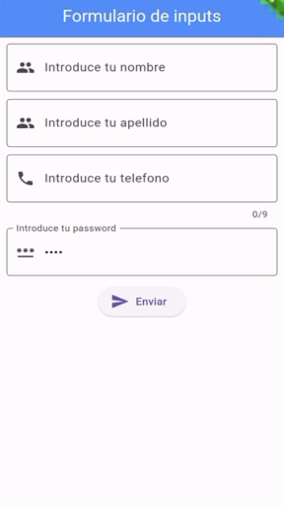 | 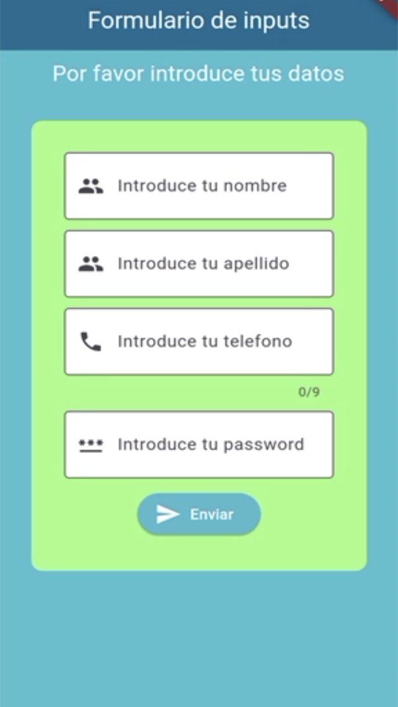 |
