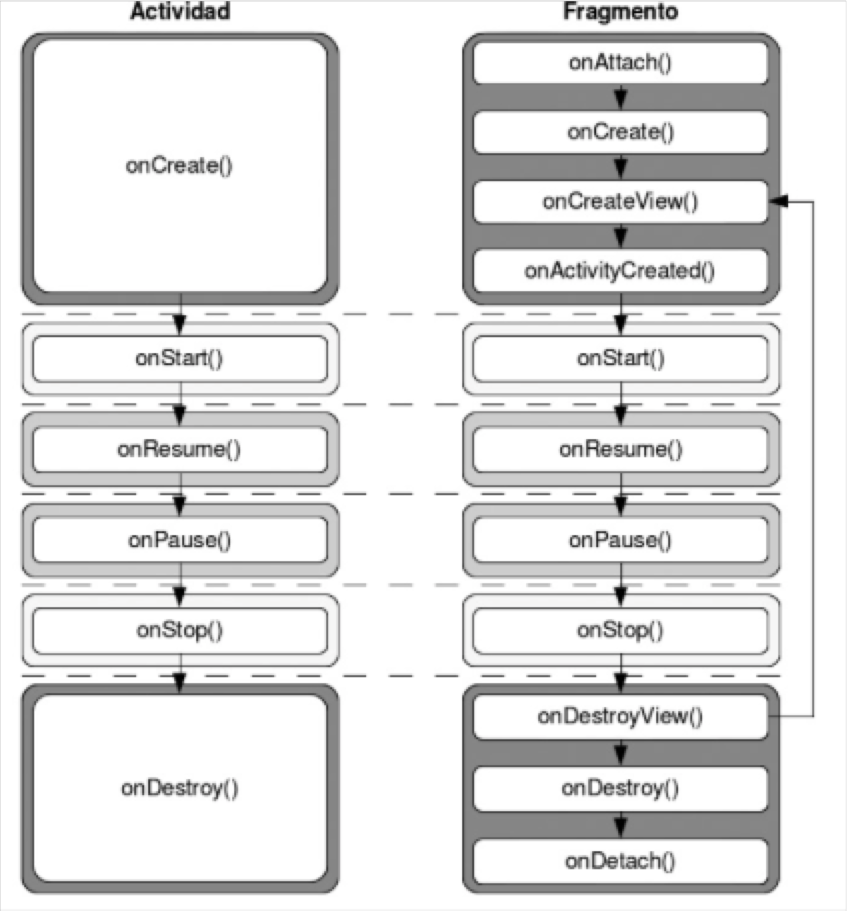
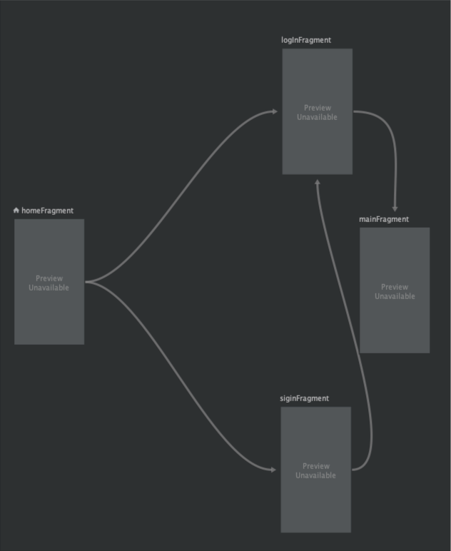

# Índice

- [Índice](#índice)
- [Objetivos](#objetivos)
- [Contenidos](#contenidos)
- [Fragments](#fragments)
- [Ciclo de vida de los fragments](#ciclo-de-vida-de-los-fragments)
- [Creación de fragments](#creación-de-fragments)
- [Añadir un fragmento a una actividad](#añadir-un-fragmento-a-una-actividad)
  - [Fragment estáticos](#fragment-estáticos)
  - [Fragments dinámicos](#fragments-dinámicos)
- [Transición entre fragments](#transición-entre-fragments)
  - [Gestionar el estado de la pila](#gestionar-el-estado-de-la-pila)
  - [Animar la transición entre fragments](#animar-la-transición-entre-fragments)
  - [Utilizar los elementos internos de un fragment](#utilizar-los-elementos-internos-de-un-fragment)
- [Comunicación entre fragments](#comunicación-entre-fragments)
  - [Fragment - Activity](#fragment---activity)
  - [Activity - Fragment](#activity---fragment)
    - [Comunicación desde 0](#comunicación-desde-0)
  - [Comunicación buscando el fragment](#comunicación-buscando-el-fragment)
- [Gráfico de navegación](#gráfico-de-navegación)
  - [Configuraciones necesarias](#configuraciones-necesarias)
  - [Manejo de la pila](#manejo-de-la-pila)
  - [Paso de parámetros](#paso-de-parámetros)


# Objetivos

- Conocer el concepto de fragments y los diferentes tipos
- Entender el ciclo de vida de un fragments
- Utilizar fragments, creación, modificación y remplazo
- Comunicar fragments entre activity y otros fragments
- Conocer como funcionan las notificaciones

# Contenidos
[Volver arriba](#índice)
HAsta este punto se ha visto como poder manejar pantallas dentro de una aplicación mediante Activitys comunicadas con Intents. Sin embargo este tipo de diseño imposibilita la modularidad, ya que cada elemento es individual y no tiene mucha relación con el resto más allá de los intents que puedan compartir. Desde la versión 3.0 se introduce el concepto de fragments, los cuales favorecen dicha modularidad. Podemos definir un fragment como una parte de la pantalla que puede ser reutilizada en varias sitios, teniendo un ciclo de vida propio. Una de las grandes capacidades de los fragments es el de permitir que para dispositivos grandes se puedan visualizar elementos de diferente que para dispositivos pequeños. El ejemplo más claro de esto es que una aplicación no debería verse igual en un móvil de 5 pulgadas que en una tablet de 11 pulgadas. Con los fragmentes tendremos la posibilidad de modular la pantalla y decidir que partes se muestran dependiendo del tamaño de la pantalla, siempre mostrando la misma activity pero con diferentes contenido (fragments)


# Fragments 
[Volver arriba](#índice)

Como se ha comentado antes, los fragments son elementos que permiten la modulación dentro de la pantalla. A grandes rasgos, un fragment es un elemento individual (con xml propio) que se incorpora dentro de una activity. Esta incorporación puede ser de dos tipos: estática (se declara el elemento en el xml de la pantalla) o dinámica (no se declara el elemento, sino que puede ser cambiante). Dependiendo de cual sea el uso que se quiera dar, utilizaremos uno u otro. Por ejemplo si todas las pantallas de nuestra aplicación tienen la misma cabecera, podremos crear un fragment estático para agregarlo en cada una de las pantallas

# Ciclo de vida de los fragments

Como se verá más adelante, los fragments son partes de la interfaz que tienen la capacidad de aparecer / desaparecer dependiendo de multitud de factores como pueden ser interacción con el usuario, configuraciones de la pantalla, etc... Muchos de los métodos son compartidos con las activitys, existiendo diferencia con los elementos que asocian / eliminan el fragment con la pantalla. El ciclo de vida comparado con el de las pantallas es el siguiente: 




Dentro del ciclo de vida, cabe destacar los siguientes métodos: 

- onAttach: el fragment se vincula con la actividad. Se suele utilizar para poder trabajar con el contexto, ya que es parámetro dentro del método
- onCreate: el fragmento y está asociado pero cuenta con interfaz gráfica. Se suele utilizar para poder intanciar elementos lógicos
- onCreateView: el fragmento se asocia a la parte gráfica
- onActivityCreated: el fragmento ya está disponible y empieza a ser visto

La misma metodología se produce cuando el fragment deja de ser visto. Para ello existen los métodoso onDestroyView, onDestroy, onDetach

# Creación de fragments

Los fragments, al igual que las activitys están representados por una clase separada, la cual extiende de Fragments. Al ser un elemento lógico, no es necesario declararlo en el AndroidManifest.xml, pero si es necesario que tenga una parte gráfica por lo que los elementos que forman un Fragment son:

- fragment_layout.xml: fichero que representa la parte lógica del fragment 
- MainFragment.kt: fichero que representa la parte lógica del fragment

Para poder crear uno, teniendo en cuenta las dependecias de archivos que acabamos de comentar quedaría de la siguiente forma:

```java
class BlankFragment : Fragment() {

    override fun onCreateView(
        inflater: LayoutInflater, container: ViewGroup?,
        savedInstanceState: Bundle?
    ): View? {
      
        return inflater.inflate(R.layout.fragment_blank, container, false)
    }
    
}
```
Como se puede ver en el código anterior, la clase extiende de Fragment y trae por defecto un método (el único obligatorio) que es el onCreateView (muy similar al método onCreate de las activitys). Esté método se encarga de asocias la parte lógica con la parte gráfica. Además de este método, se pueden utilizar métodos del ciclo de vida del fragment al igual que pasaba en las activtys, poniendo especial interés en el método onAttach() y onDetach(). Ambos métodos se ejecutan cuando el fragment se asocia a la parte de la pantalla que se quiere y cuando se desasocia (recordad que los fragments son partes de la pantalla que pueden aparecer y desaparecer)

# Añadir un fragmento a una actividad

Una vez el fragment está creado, es necesario agregarlo a una activity. Para ello dependeré del tipo de fragment que queramos agregar, ya que agregarlo a la pantalla no se realiza de la misma forma

## Fragment estáticos

Son aquellos que se agregan directamente al xml de la actividad sobre la cual queremos poner el elemento. Es muy importante saber que si se realiza este tipo de añadido, el fragment no se podrá modificar en tiempo de ejecución, ya que siempre aparecerá el mismo. Para poder hacer esto, primero tendremos creada una clase como la que se ha mostrado antes. El nombre de la clase es muy importante ya que será lo que utilizaremos para poder indicar el fragment que se quiere mostrar. En el xml de la activity donde se quiere agregar el fragment, se utiliza la etiqueta <fragment> indicando en el atributo name la clase del fragment que se quiere mostar

```xml
<LinearLayout xmlns:android="http://schemas.android.com/apk/res/android"
    xmlns:app="http://schemas.android.com/apk/res-auto"
    xmlns:tools="http://schemas.android.com/tools"
    android:layout_width="match_parent"
    android:layout_height="match_parent"
    tools:context=".MainActivity">

    <fragment
        android:layout_width="match_parent"
        android:layout_height="wrap_content"
        android:name="com.develop.t7_fragments.fragments.BlankFragment"
        />

</LinearLayout>
```

Es importante ver que dependiendo de cual sea el tamaño que se indique así se mostrará. En este ejemplo, al mostrarse con un tamaño de wrap_content en alto, ocupará lo que indique el xml asociado en el fragment. Una vez indicado esto, se agregará el fragment a la vista. Como se ha comentado antes, este tipo de fragments tiene un uso limitado, ya que es igual que utilizar una Activity como las que se han utilizado hasta este momento. Puede ser interesante para aquellos casos en que la vista se quiera reutilizar en varios sitios.

## Fragments dinámicos

En el caso de querer hacer la interfaz modulable y que se pueda ver diferente en el caso de pantallas grandes - pequeñas, horizontal - vertical, etc.... el uso de fragments estáticos limita mucho este tipo de casos. Para ello se utilizan los fragments dinámicos, que son aquellos que tienen la capacidad de aparecer y desaparecer en ejecución dentro de una misma activity. Algunas cosas que hay que tener en cuenta a la hora de trabajar con fragments dinámicos son las siguientes: 
- No hay que declararlos en el manifest, ya que son elementos gráficos que se muestran en momentos de ejecución
- Tienen una parte gráfica (.xml) y una parte lógica independiente
- Ya que son mostrados dentro de una pantalla, para poder mostrarlos con la posibilidad de hacerlos visibles o no, es necesario que la activity utilice un frame layout como base, ya que es el único que permite apilar elementos.

Para poder explicar esto, vamos hacer un ejemplo simple de como poder añadir un fragment estático a una pantalla. Para ello se cuenta con el siguiente xml de la activity

```xml
<?xml version="1.0" encoding="utf-8"?>
<FrameLayout xmlns:android="http://schemas.android.com/apk/res/android"
    xmlns:app="http://schemas.android.com/apk/res-auto"
    xmlns:tools="http://schemas.android.com/tools"
    android:layout_width="match_parent"
    android:layout_height="match_parent"
    android:id="@+id/ubicacion_fragments"
    tools:context=".MainActivity">
    

</FrameLayout>
```

En este caso tan solo se tiene un frame layout ya que solo se quieren incluir fragments en la pantalla. En el caso de querer poner más elementos como toolbar, navigation, etc... sería necesario combinar este frame layout con otros. 

Es muy importante que el frame layout tenga un id para poder acceder a el desde el código, ya que será la forma mediante la cual indicaremos en que parte se tendrá que situar el fragment. Una vez se tiene la pantalla, vamos ahora a crear un fragment. Como se ha dicho antes, estos elementos tienen tanto parte lógica como parte gráfica independiente, por lo que tendremos los siguientes ficheros:

```xml
<?xml version="1.0" encoding="utf-8"?>
<androidx.constraintlayout.widget.ConstraintLayout xmlns:android="http://schemas.android.com/apk/res/android"
    xmlns:app="http://schemas.android.com/apk/res-auto"
    xmlns:tools="http://schemas.android.com/tools"
    android:layout_width="match_parent"
    android:layout_height="match_parent">


    <TextView
        android:layout_width="wrap_content"
        android:layout_height="wrap_content"
        android:id="@+id/texto_fragment"
        android:text="FRAGMENT INICIAL"
        app:layout_constraintBottom_toBottomOf="parent"
        app:layout_constraintEnd_toEndOf="parent"
        app:layout_constraintStart_toStartOf="parent"
        app:layout_constraintTop_toTopOf="parent" />

    <Button
        android:layout_width="wrap_content"
        android:layout_height="wrap_content"
        android:id="@+id/boton_fragment"
        android:layout_marginTop="20dp"
        android:text="Iniciar"
        app:layout_constraintEnd_toEndOf="@+id/texto_fragment"
        app:layout_constraintStart_toStartOf="@+id/texto_fragment"
        app:layout_constraintTop_toBottomOf="@+id/texto_fragment" />


</androidx.constraintlayout.widget.ConstraintLayout>
```
Este fichero representa el aspecto gráfico que tendrá el fragment. Es importante que cada uno de los elementos tenga un id, ya que además de utilizarlo para configurar las restricciones, será el elemento a través del cual se pueda acceder en la parte lógica

```java
class FramentInicial : Fragment() {

    override fun onCreateView(
        inflater: LayoutInflater,
        container: ViewGroup?,
        savedInstanceState: Bundle?
    ): View? {

        return inflater.inflate( R.layout.inicial_fragment, container, false)

    }

}
```
Este archivo representa la parte lógica. Como se pudo ver en el ciclo de vida, el método onCreteView es el método que se ejecuta cuando el fragment se asocia a una vista. Lo que devuelve el método es lo que el fragment pintará.  En el caso de utilizar el binding para hacer la asociación directa sería de la siguiente forma

```java
class FramentInicial : Fragment() {

    private lateinit var binding: InicialFragmentBinding

    override fun onCreateView(
        inflater: LayoutInflater,
        container: ViewGroup?,
        savedInstanceState: Bundle?
    ): View? {
        binding = InicialFragmentBinding.inflate(inflater, container, false)
        return binding.root

    }

}
```

Con la creación de estos dos ficheros el fragment dinámico quedaría creado. Ahora solo faltaría añadirlo a la actividad (recordad que se ha credo una activity donde el layout general es un frame layout). En los siguientes puntos veremos posibilidades de añadir, pero ahora vemos a utilizar un método genérico. Para ello vamos a utilizar un objeto nuevo: fragment manager. Este objeto es el encargado de gestionar la pila de framents, indicando cuales son los que están en ejecución y cuales son los que están en "pausa". Si recordamos del tema de los diálogos, este concepto ya lo vimos ya que es el mismo objeto el que se encarga de su funcionamiento. 

Para poder crear un objeto de tipo FragmentManager lo podemos hacer a través de la activity y en concreto el objeto supportFragmentManager. A través de este objeto podremos acceder a otro llamado FragmentTransaction, el cual permite los "movimientos" que veremos en el siguiente punto. Por lo tanto para poder poder poner el fragment dentro de la activity utilizaremos el siguiente código

```java
supportFragmentManager.beginTransaction().add(binding.ubicacionFragments.id, FramentInicial()).commit()
```

El método add lo que hace es añadir el fragment en la ubicación indicada a la pila de ejecuciones. Una vez ejecutado esto, el fragment inicial aparecerá en pantalla cargado. 

# Transición entre fragments

Si bien en el punto anterior lo que hemos hecho ha sido agregar un fragment directamente a la pila de ejecución, la tarea no es tan sencilla como el ejemplo anterior. De lo que se trata es de ser capaces de ejecutar movimientos o transiciones entre elementos de tal forma que en una determinada parte de la pantalla (la configurada como FrameLayout) los elementos aparezcan y desaparezcan en función de la actuación del usuario y/o configuraciones del dispositivo. Para poder hacer esto debemos tener en cuenta dos de los elementos nombrados en el punto anterior: 

- FragmentManager: elemento que permite la gestión de los fragments, pudiendo acceder en todo momento a la situación actual del elemento. Es importante saber que este objeto necesita de una instancia por cada vez que lo queramos utilizar, ya que en cada momento su valor cambia

- FragmentTransaction: elemento que permite el movimiento de fragments que queramos ubicar dentro del fragment manager. Para poder obtener un objeto de este tipo, préviamente es necesario obtener un objeto del tipo fragment manager

```java
supportFragmentManager.beginTransaction()
```

Una vez están claros estos conceptos, vamos a ver cuales son los métodos principales a la hora de trabajar con transiciones: 

- add: añade un fragmento a la pila de ejecución 
- remove: elimina un fragmento a la pila de ejecución
- replace: cambia el fragmento existente por otro indicado

PAra explicar la funcionalidad de cada uno de ellos, vamos a realizar un ejemplo donde con la pulsación de tres botones se irán cargando fragmentos en la pila. El xml de dicha actividad será el siguiente: 

```xml
<?xml version="1.0" encoding="utf-8"?>
<LinearLayout xmlns:android="http://schemas.android.com/apk/res/android"
    xmlns:app="http://schemas.android.com/apk/res-auto"
    xmlns:tools="http://schemas.android.com/tools"
    android:orientation="vertical"
    android:layout_width="match_parent"
    android:layout_height="match_parent"
    tools:context=".MainActivity">

    <LinearLayout
        android:layout_width="match_parent"
        android:layout_height="wrap_content">

        <Button
            android:id="@+id/boton_f1"
            android:layout_width="0dp"
            android:layout_weight="0.3"
            android:layout_height="wrap_content"
            android:text="Cargar f1" />

        <Button
            android:id="@+id/boton_f2"
            android:layout_width="0dp"
            android:layout_weight="0.3"            android:layout_height="wrap_content"
            android:text="Cargar f2" />

        <Button
            android:id="@+id/boton_f3"
            android:layout_width="0dp"
            android:layout_weight="0.3"            android:layout_height="wrap_content"
            android:text="Cargar f3" />
    </LinearLayout>

    <FrameLayout
            android:id="@+id/ubicacion_fragments"
        android:layout_width="match_parent"
        android:layout_height="match_parent"/>


</LinearLayout>
```

Para cada uno de los fragments que se cargarán con la pulsación de los botones se utilizará la misma estructura que en el caso anterior, cambiando únicamente el texto de la etiqueta del fragment

Una vez se tiene toda la estructura vamos a proceder a añadir cada fragment con la pulsación de cada botón. Para ello ejecutaremos el siguiente código

```java
class MainActivity : AppCompatActivity(), OnClickListener {

    private lateinit var binding: ActivityMainBinding
    override fun onCreate(savedInstanceState: Bundle?) {
        super.onCreate(savedInstanceState)
        binding = ActivityMainBinding.inflate(layoutInflater)
        setContentView(binding.root)

        binding.botonF1.setOnClickListener(this)
        binding.botonF2.setOnClickListener(this)
        binding.botonF3.setOnClickListener(this)

    }

    override fun onClick(p0: View?) {
        var fragmentTransaction = supportFragmentManager.beginTransaction()

        when(p0!!.id){
            binding.botonF1.id ->{
                fragmentManager.add(binding.ubicacionFragments.id, FragmentInicial())
            }
            binding.botonF2.id ->{
                fragmentManager.add(binding.ubicacionFragments.id, FragmentSecond())
            }
            binding.botonF3.id ->{
                fragmentTransaction.add(binding.ubicacionFragments.id, FragmentThird())
            }
        }

        fragmentTransaction.commit();
    }
}
```
Si ejecutamos esto y pulsamos a cada uno de los botones, podemos comprobar que los fragments van apareciendo pero se ván superponeniendo unos con otros. De hecho si despues de agregar un fragment intentamos buscarlo por su tag o por su id en caso de ser estático podríamos encontrarlo

```java
Log.v("numero_fragments",supportFragmentManager.fragments.size.toString() )
```

En este caso sería bastante complicado el agregar y recuperar fragments, ya que tendríamos que estar utilizando el método remove y el método add constantemente. En el caso de querer agregar fragments pero que se sustituyan unos por otros, es muy recomendable utilizar el método replace, donde es necesario indicar el fragment que va a sustituir al actual y el sitio donde lo va a sustituir. En este caso el código anterior quedaría de la siguiente forma: 

```java
    override fun onClick(p0: View?) {
        var fragmentTransaction = supportFragmentManager.beginTransaction()

        when(p0!!.id){
            binding.botonF1.id ->{
                Log.v("test", "pulsado1")
                fragmentTransaction.replace(binding.ubicacionFragments.id, FragmentInicial())
            }
            binding.botonF2.id ->{
                Log.v("test", "pulsado2")
                fragmentTransaction.replace(binding.ubicacionFragments.id, FragmentSecond())
            }
            binding.botonF3.id ->{
                Log.v("test", "pulsado3")
                fragmentTransaction.replace(binding.ubicacionFragments.id, FragmentThird())
            }
        }

        fragmentTransaction.commit();
        Log.v("numero_fragments",supportFragmentManager.fragments.size.toString() )
    }
```

De esta forma siempre habrá un fragment cargado en la pila pero el resto no se irán superponiendo, sino lo que harán será reemplazarlo por el actual. Pero en este caso, ¿Como sería posible recuperar alguno de los fragments que ya han sido cargados previamente? Es aquí donde entra el estado de la pila

## Gestionar el estado de la pila

Hasta este punto hemos visto como poder gestionar las transiciones entre fragments, bien sea con el add o con el replace. Como se ha comentado en el caso anterior, el replace es más útil cuando los movimientos entre fragments son muy constante, siempre manteniendo uno el la pila y haciendo reemplazos constantes. Para poder gestionar estos reemplazos existe lo que se llama el estado de la pila. Al no apilar fragments, es necesario tener algún mecanismo para que en el caso de querer recuperar alguno que ya haya salido no tener que repetir la operación. Esto se controla mediante el método addToBackStack. Dicho método será ejecutado cuando se hace un reemplazo, indicando un tag para más adelante poder hacer la búsqueda para dicho estado. 

```java
    override fun onClick(p0: View?) {
        var fragmentTransaction = supportFragmentManager.beginTransaction()

        when(p0!!.id){
            binding.botonF1.id ->{
                fragmentTransaction.replace(binding.ubicacionFragments.id, FragmentInicial())
                fragmentTransaction.addToBackStack("f1_top")
            }
            binding.botonF2.id ->{
                fragmentTransaction.replace(binding.ubicacionFragments.id, FragmentSecond())
                fragmentTransaction.addToBackStack("f2_top")
            }
            binding.botonF3.id ->{
                fragmentTransaction.replace(binding.ubicacionFragments.id, FragmentThird())
                fragmentTransaction.addToBackStack("f3_top")*/
                
            }
        }

        fragmentTransaction.commit();
        Log.v("estados",supportFragmentManager.backStackEntryCount.toString() )

    }
```

En este caso, al utilizar addToBackStack, la pila irá cargando estado según se realicen pulsaciones. Por ejemplo, en el caso de querer que al pulsar un botón si el fragment ya está cargado no lo vuelva a meter en la pila, habría que buscarlo antes y dependiendo del resultado cargarlo o no en la pila

```java
binding.botonF1.id ->{
                fragmentTransaction.replace(binding.ubicacionFragments.id, FragmentInicial())

                if(supportFragmentManager.findFragmentById(binding.ubicacionFragments.id) as? FragmentInicial == null){
                    fragmentTransaction.addToBackStack("f1_top")
                }

            }
```

Con la búsqueda del fragment se obtendrá true si se encuentra dentro de la pila. En el caso de ser null se cargará dentro de la pila de estados. en caso contrario simplemente se hará un replace sin hacer ninguna carga

## Animar la transición entre fragments

Como se ha visto en el ejemplo anterior, al pulsar cada uno de los botones, los fragments van apareciendo en la pantalla pero de forma directa. Si le queremos dar una vuelta a esto y hacerlo más visible podemos animar tanto la entrada como la salida de los elementos. Para ello se ejecuta el método setCustomAnimation, donde es necesario indicar cual es la animación de salida y de entrada.

```java
fragmentTransaction.setCustomAnimations(android.R.anim.slide_in_left,
                    android.R.anim.slide_out_right);
```

En este caso se están utilizando animaciones propias de android, pero nos podríamos declarar nuestras propias animaciones dentro de un xml y aplicarla. Esto lo veremos en temas más adelante.

## Utilizar los elementos internos de un fragment

Hasta este punto hemos visto como poder cambiar fragments que están puestos en la pantalla mediante pulsaciones de botones (podría ser cualquier otra acción) pero no hemos visto como poder utilizar los elementos que pertenecen al fragment como tal (listas, botones, etc...). Para ello nos vamos a centrar en la clase que representa el fragment. Si recordamos teníamos tres fragments con únicamente un botón y un texto. Vamos a modificar el primero de los fragments para que tenga un campo de texto, un spinner y un botón. El xml quedaría de la siguiente forma

```xml
<?xml version="1.0" encoding="utf-8"?>
<androidx.constraintlayout.widget.ConstraintLayout xmlns:android="http://schemas.android.com/apk/res/android"
    xmlns:app="http://schemas.android.com/apk/res-auto"
    xmlns:tools="http://schemas.android.com/tools"
    android:layout_width="match_parent"
    android:layout_height="match_parent"
    android:padding="50dp">


    <TextView
        android:layout_width="0dp"
        android:layout_height="wrap_content"
        android:id="@+id/texto_fragment"
        android:text="FRAGMENT INICIAL"
        app:layout_constraintBottom_toBottomOf="parent"
        app:layout_constraintEnd_toEndOf="parent"
        app:layout_constraintStart_toStartOf="parent"
        app:layout_constraintTop_toTopOf="parent" />

    <Spinner
        android:id="@+id/spinner_fragment"
        android:layout_width="0dp"
        android:layout_height="wrap_content"
        android:layout_marginTop="20dp"
        app:layout_constraintEnd_toEndOf="@+id/texto_fragment"
        app:layout_constraintStart_toStartOf="@+id/texto_fragment"
        app:layout_constraintTop_toBottomOf="@+id/texto_fragment" />

    <EditText
        android:layout_marginTop="20dp"
        android:id="@+id/edit_fragment"
        android:layout_width="0dp"
        android:layout_height="wrap_content"
        app:layout_constraintEnd_toEndOf="@+id/spinner_fragment"
        app:layout_constraintStart_toStartOf="@+id/spinner_fragment"
        app:layout_constraintTop_toBottomOf="@+id/spinner_fragment" />

    <Button
        android:layout_marginTop="20dp"
        android:id="@+id/boton_fragment"
        android:layout_width="wrap_content"
        android:layout_height="wrap_content"
        android:text="Iniciar"
        app:layout_constraintEnd_toEndOf="@+id/texto_fragment"
        app:layout_constraintHorizontal_bias="0.47"
        app:layout_constraintStart_toStartOf="@+id/texto_fragment"
        app:layout_constraintTop_toBottomOf="@+id/edit_fragment" />


</androidx.constraintlayout.widget.ConstraintLayout>
```

Con todos los elementos del fragment declarados vamos a la clase lógica del mismo.

```java
class FragmentInicial : Fragment() {

    private lateinit var binding: InicialFragmentBinding

    override fun onCreateView(
        inflater: LayoutInflater,
        container: ViewGroup?,
        savedInstanceState: Bundle?
    ): View? {
        binding = InicialFragmentBinding.inflate(inflater, container, false)
        return binding.root

    }

}
```

Gracias al binding, el fragment ya tiene todos los elemento gráficos instanciados, por lo que tan solo sería necesario utilizarlos. Lo más importante de esto es que no pueden ser utilizados antes de asocias la vista (y por lo tanto ejecutar el método OnCreateView), por lo que se recomiendo trabajar con el método onViewCreated

```java
class FragmentInicial : Fragment() {

    private lateinit var binding: InicialFragmentBinding
    private lateinit var arrayLenguajes: Array<String>

    override fun onAttach(context: Context) {
        super.onAttach(context)
        arrayLenguajes = arrayOf("Kotlin", "Java", "Python", "JS", "C#")
    }

    override fun onCreateView(
        inflater: LayoutInflater,
        container: ViewGroup?,
        savedInstanceState: Bundle?
    ): View? {
        binding = InicialFragmentBinding.inflate(inflater, container, false)
        return binding.root

    }

    override fun onViewCreated(view: View, savedInstanceState: Bundle?) {
        super.onViewCreated(view, savedInstanceState)
        binding.spinnerFragment.adapter = ArrayAdapter<String>(requireContext(), android.R.layout.simple_spinner_item, arrayLenguajes)
        (binding.spinnerFragment.adapter as ArrayAdapter<String>).setDropDownViewResource(android.R.layout.simple_spinner_dropdown_item)
        binding.botonFragment.setOnClickListener {
            if (!binding.editFragment.text.isEmpty()){
                val lenguaje = binding.spinnerFragment.selectedItem
                Snackbar.make(binding.root,"Lenguaje seleccionado ${lenguaje}",Snackbar.LENGTH_SHORT).show()

            }

        }
    }

}
```

# Comunicación entre fragments

## Fragment - Activity

Al igual que hacíamos en los cuadros de diálogo o en los recycler view, la comunicación de los fragments con la activity es mediante interfaces de callback o mediante funciones vacías. En este caso, y al no definir los fragments como objetos dentro de la activiy, se va a optar por la primera opción al mejorar mucho el rendimiento. Si recordamos de temas anteriores, el proceso requería de los siguientes pasos:

1. Declarar una interfaz en el origen de los datos (en este caso el fragment) desde el cual se quiere lanzar la comunicación. En esta interfaz es necesario crear tantos métodos como sean necesarios para hacer la comunicación. Para explicar esto vamos a seguir el ejemplo empezar en el punto anterior, donde en el fragment inicial teníamos que seleccionar un lenguaje en el spinner del fragment y teníamos un edit texto para poder un comentario. Estos dos datos serán los que se comunicarán a la activity

```java
interface OnLenguajeListener{
        fun onLenguajeSelected(lenguaje: String)
    }
```

Con la interfaz creada es necesario utilizar el método cuando se quiera realizar la comunicación, por lo que tendremos que crear un objeto del tipo de la interfaz y llamar el método cuando se pulse el botón del fragment

```java
    private lateinit var listener: OnLenguajeListener

    override fun onViewCreated(view: View, savedInstanceState: Bundle?) {
        super.onViewCreated(view, savedInstanceState)
        binding.spinnerFragment.adapter = ArrayAdapter<String>(requireContext(), android.R.layout.simple_spinner_item, arrayLenguajes)
        (binding.spinnerFragment.adapter as ArrayAdapter<String>).setDropDownViewResource(android.R.layout.simple_spinner_dropdown_item)
        binding.botonFragment.setOnClickListener {
            if (!binding.editFragment.text.isEmpty()){
                val lenguaje = binding.spinnerFragment.selectedItem.toString()
                val comentario = binding.editFragment.text.toString()
                listener.onLenguajeSelected(lenguaje,comentario)
            }

        }
    }

```

2. Para que el objeto pueda ser llamado, es necesario que tenga valor ya que en el caso de ser nulo provocaría un fallo. Para darle valor es necesario igualar la variable al contexto (que será la clase desde donde se llama al fragment), casteándola al tipo de la interfaz. Para ello se utiliza el método onAttach ya que tiene el contexto como parámetro

```java
    private lateinit var listener: OnLenguajeListener

    override fun onAttach(context: Context) {
        super.onAttach(context)
        arrayLenguajes = arrayOf("Kotlin", "Java", "Python", "JS", "C#")
        try {
            listener = context as OnLenguajeListener    
        } catch (e: java.lang.ClassCastException){
            Log.v("conversion", "error de conversion en el tipo")
        }
        
    }
```

Para que esta igualdad tenga sentido, es necesario implementar en el destino de la comunicación (en nuestro caso el activity) la interfaz, de forma que sea obligatorio la escritura de cada uno de los métodos

```java
class MainActivity : AppCompatActivity(), OnClickListener, FragmentInicial.OnLenguajeListener {

    private lateinit var binding: ActivityMainBinding
    override fun onCreate(savedInstanceState: Bundle?) {
        super.onCreate(savedInstanceState)
        binding = ActivityMainBinding.inflate(layoutInflater)
        setContentView(binding.root)

        binding.botonF1.setOnClickListener(this)
        binding.botonF2.setOnClickListener(this)
        binding.botonF3.setOnClickListener(this)

    }

    override fun onClick(p0: View?) {
        var fragmentTransaction = supportFragmentManager.beginTransaction()

        when(p0!!.id){
            binding.botonF1.id ->{
                fragmentTransaction.replace(binding.ubicacionFragments.id, FragmentInicial())
                fragmentTransaction.setCustomAnimations(android.R.anim.slide_in_left,
                    android.R.anim.slide_out_right);
                if(supportFragmentManager.findFragmentById(binding.ubicacionFragments.id) as? FragmentInicial == null){
                    fragmentTransaction.addToBackStack("f1_top")
                }

            }
            binding.botonF2.id ->{
                fragmentTransaction.replace(binding.ubicacionFragments.id, FragmentSecond())
                fragmentTransaction.setCustomAnimations(android.R.anim.slide_in_left,
                    android.R.anim.slide_out_right);
                fragmentTransaction.addToBackStack("f2_top")
            }
            binding.botonF3.id ->{

                fragmentTransaction.replace(binding.ubicacionFragments.id, FragmentThird())
                fragmentTransaction.setCustomAnimations(android.R.anim.slide_in_left,
                    android.R.anim.slide_out_right);
                fragmentTransaction.addToBackStack("f3_top")

            }
        }

        fragmentTransaction.commit();
       

    }

    override fun onLenguajeSelected(lenguaje: String, comentario: String) {
        TODO("Not yet implemented")
    }
}
```

Una vez hecho esto tan solo quedaría utilizar los método tal y como indique la lógica de la aplicación, ya que en la activity se tendrían todos los datos comunicados. En este ejemplo sacaremos un Snackbar con los datos seleccionados.

```java
  override fun onLenguajeSelected(lenguaje: String, comentario: String) {
        Snackbar.make(
            binding.root,
            "El lenguaje seleccionado es ${lenguaje} con los siguientes comentarios: ${comentario}",
            Snackbar.LENGTH_SHORT
        ).show()
    }
```

El código completo del fragment sería el siguiente:

```java
class FragmentInicial : Fragment() {

    private lateinit var binding: InicialFragmentBinding
    private lateinit var arrayLenguajes: Array<String>
    private lateinit var listener: OnLenguajeListener

    override fun onAttach(context: Context) {
        super.onAttach(context)
        arrayLenguajes = arrayOf("Kotlin", "Java", "Python", "JS", "C#")
        try {
            listener = context as OnLenguajeListener
        } catch (e: java.lang.ClassCastException){
            Log.v("conversion", "error de conversion en el tipo")
        }

    }

    override fun onCreateView(
        inflater: LayoutInflater,
        container: ViewGroup?,
        savedInstanceState: Bundle?
    ): View? {
        binding = InicialFragmentBinding.inflate(inflater, container, false)
        return binding.root

    }

    override fun onViewCreated(view: View, savedInstanceState: Bundle?) {
        super.onViewCreated(view, savedInstanceState)
        binding.spinnerFragment.adapter = ArrayAdapter<String>(requireContext(), android.R.layout.simple_spinner_item, arrayLenguajes)
        (binding.spinnerFragment.adapter as ArrayAdapter<String>).setDropDownViewResource(android.R.layout.simple_spinner_dropdown_item)
        binding.botonFragment.setOnClickListener {
            if (!binding.editFragment.text.isEmpty()){
                val lenguaje = binding.spinnerFragment.selectedItem.toString()
                val comentario = binding.editFragment.text.toString()
                listener.onLenguajeSelected(lenguaje,comentario)
            }

        }
    }

    interface OnLenguajeListener{
        fun onLenguajeSelected(lenguaje: String, comentario: String)
    }
}
```

En el siguiente punto veremos como poder pasar los datos de la activity a un fragment. 

## Activity - Fragment

El otro tipo de comunicación que existe dentro de los fragments es el de mandar datos desde la pantalla al fragment. En este caso se pueden dar dos tipos de comunicación: si queremos arrancar un fragment que no existe o si queremos pasar datos a un fragment que no existe en la pila de ejecución. Por norma general utilizaremos el primero de los casos, pero siempre es posible que nos encontremos en algún escenario donde nos sirva buscar y ejecutar cosas de un fragment existente:

### Comunicación desde 0

En este caso el fragment al que le queremos comunicar datos no está en la pila, por lo que lo debemos arrancar y pasar datos al mismo tiempo. Para poder hacer esto se utilizan los argumentos, que son partes que se e añaden al fragment en su creación. Como no es posible modificar el constructor de un fragment por extender de una clase ya creada, se utiliza un constructor estático, representado en kotlin por un objeto de tipo companion. Este objeto es declarado dentro de la clase fragment y dentro tiene declarados todos los elementos que son necesarios. De esta forma se podrán ejecutar como métodos estáticos. Para el ejemplo vamos a continuar la comunicación anterior, pasando el lenguaje seleccionado y comentario al segundo fragment. Si recordamos el aspecto gráfico del segundo fragment con las modificaciones ya hechas es el siguiente: 


```xml
<?xml version="1.0" encoding="utf-8"?>
<androidx.constraintlayout.widget.ConstraintLayout xmlns:android="http://schemas.android.com/apk/res/android"
    xmlns:app="http://schemas.android.com/apk/res-auto"
    xmlns:tools="http://schemas.android.com/tools"
    android:layout_width="match_parent"
    android:layout_height="match_parent">


    <TextView
        android:layout_width="wrap_content"
        android:layout_height="wrap_content"
        android:id="@+id/texto_fragment_2"
        android:text="FRAGMENT SENCUNDARIO"
        app:layout_constraintBottom_toBottomOf="parent"
        app:layout_constraintEnd_toEndOf="parent"
        app:layout_constraintStart_toStartOf="parent"
        app:layout_constraintTop_toTopOf="parent" />

    <TextView
        android:layout_marginTop="20dp"
        android:id="@+id/texto_fragment_comunicado"
        android:layout_width="wrap_content"
        android:layout_height="wrap_content"
        app:layout_constraintEnd_toEndOf="@+id/texto_fragment_2"
        app:layout_constraintStart_toStartOf="@+id/texto_fragment_2"
        app:layout_constraintTop_toBottomOf="@+id/texto_fragment_2" />


    <Button
        android:layout_marginTop="20dp"
        android:id="@+id/boton_fragment"
        android:layout_width="wrap_content"
        android:layout_height="wrap_content"
        android:text="Contestar"
        app:layout_constraintEnd_toEndOf="@+id/texto_fragment_comunicado"
        app:layout_constraintStart_toStartOf="@+id/texto_fragment_comunicado"
        app:layout_constraintTop_toBottomOf="@+id/texto_fragment_comunicado" />


</androidx.constraintlayout.widget.ConstraintLayout>
```

Para poder pasar datos al fragment secundario tendremos que seguir los siguientes pasos

1. Crear un objeto companion en el destino de la comunicación: dentro de este objeto declararemos la función y elementos que serán ejecutados de forma directa. Es lo que en java se llaman métodos estáticos

```java
class FragmentSecond : Fragment() {

    private lateinit var binding: SecondFragmentBinding

    companion object{
        fun newInstance(lenguaje: String, comentario: String):FragmentSecond {
            val args = Bundle()
            val fragment = FragmentSecond()
            args.putString("lenguaje", lenguaje)
            args.putString("comentario", comentario)
            fragment.arguments = args
            return fragment
        }
    }

    override fun onCreateView(
        inflater: LayoutInflater,
        container: ViewGroup?,
        savedInstanceState: Bundle?
    ): View? {
        binding = SecondFragmentBinding.inflate(inflater, container, false)
        return binding.root

    }

}
```

Dentro del objeto companion se crea una función que devuelve un objeto de tipo Fragment, el cual queremos crear. Sobre este objeto se ponen tantos argumentos (en un bundle) como se quieran y se retorna el fragment con el método setArgument ejecutado. Una vez se retorna el fragment el ciclo de vida normal del mismo se empezará a ejecutar

2. Una vez retornado el fragment mediante el método newInstance, en el ciclo de vida del fragment será necesario capturar los argumentos, recuperarlos y utilizarlos dentro de la parte que queramos. 

```java
class FragmentSecond : Fragment() {

    private lateinit var binding: SecondFragmentBinding
    private lateinit var lenguaje: String
    private lateinit var comentario: String

    companion object{
        fun newInstance(lenguaje: String, comentario: String):FragmentSecond {
            val args = Bundle()
            val fragment = FragmentSecond()
            args.putString("lenguaje", lenguaje)
            args.putString("comentario", comentario)
            fragment.arguments = args
            return fragment
        }
    }

    override fun onAttach(context: Context) {
        super.onAttach(context)
        lenguaje = arguments?.getString("lenguaje") ?: ""
        comentario= arguments?.getString("comentario") ?: ""
    }


    override fun onCreateView(
        inflater: LayoutInflater,
        container: ViewGroup?,
        savedInstanceState: Bundle?
    ): View? {
        binding = SecondFragmentBinding.inflate(inflater, container, false)
        return binding.root

    }


    override fun onViewCreated(view: View, savedInstanceState: Bundle?) {
        super.onViewCreated(view, savedInstanceState)
        binding.textoFragment2.text = lenguaje
        binding.textoFragmentComunicado.text = comentario
    }

}
```

En el método onAttach mediante el elemento arguments podemos recuperar cada uno de los elementos mediante su key. Hay que tener en cuenta que este elemento puede ser nulo, pero que las variables que utilicemos no deben serlo, por lo que es obligatorio el uso de null safety u operador elvis

3. Por último, para poder utilizar este paso de datos, es necesario llamar al método newInstance cuando queremos crear el fragment. Para ello, desde el método de la interfaz que se implementó en el punto anterior se llama al fragment con el método

```java
class MainActivity : AppCompatActivity(), OnClickListener, FragmentInicial.OnLenguajeListener {

    private lateinit var binding: ActivityMainBinding
    override fun onCreate(savedInstanceState: Bundle?) {
        super.onCreate(savedInstanceState)
        binding = ActivityMainBinding.inflate(layoutInflater)
        setContentView(binding.root)

        binding.botonF1.setOnClickListener(this)
        binding.botonF2.setOnClickListener(this)
        binding.botonF3.setOnClickListener(this)

    }

    override fun onClick(p0: View?) {
        var fragmentTransaction = supportFragmentManager.beginTransaction()

        when (p0!!.id) {
            binding.botonF1.id -> {
                fragmentTransaction.replace(binding.ubicacionFragments.id, FragmentInicial())
                fragmentTransaction.setCustomAnimations(
                    android.R.anim.slide_in_left,
                    android.R.anim.slide_out_right
                );
                if (supportFragmentManager.findFragmentById(binding.ubicacionFragments.id) as? FragmentInicial == null) {
                    fragmentTransaction.addToBackStack("f1_top")
                }

            }
            binding.botonF2.id -> {
                fragmentTransaction.replace(binding.ubicacionFragments.id, FragmentSecond())
                fragmentTransaction.setCustomAnimations(
                    android.R.anim.slide_in_left,
                    android.R.anim.slide_out_right
                );
                fragmentTransaction.addToBackStack("f2_top")
            }
            binding.botonF3.id -> {

                fragmentTransaction.replace(binding.ubicacionFragments.id, FragmentThird())
                fragmentTransaction.setCustomAnimations(
                    android.R.anim.slide_in_left,
                    android.R.anim.slide_out_right
                );
                fragmentTransaction.addToBackStack("f3_top")

            }
        }

        fragmentTransaction.commit();
        Log.v("numero_fragments", supportFragmentManager.fragments.size.toString())
        Log.v("estados", supportFragmentManager.backStackEntryCount.toString())


    }

    override fun onLenguajeSelected(lenguaje: String, comentario: String) {
        supportFragmentManager.beginTransaction().replace(
            binding.ubicacionFragments.id,
            Fragm.commit()entSecond.newInstance(lenguaje, comentario)
        ).commit()
        /*Snackbar.make(
                binding.root,
                "El lenguaje seleccionado es ${lenguaje} con los siguientes comentarios: ${comentario}",
                Snackbar.LENGTH_SHORT
            ).show()*/
    }
}
```

## Comunicación buscando el fragment

El caso anterior se basa en una comunicación donde el fragment con el que se quiere comunicar no existe y hay que crearlo con los datos ya puestos. Pero en el caso de que el fragment ya exista, es necesario buscarlo en la pila de ejecución y pasarle los datos que se quieran. Este tipo de comunicación combina todo lo anterior. Para este ejemplo vamos a realizar una pulsación en el botón del segundo fragment (el que acabamos de terminar) y le vamos a pasar un dato al fragment inicial, el cual ya estará en la pila. Para ello realizaremos los siguientes pasos:

1. Crear una interfaz de callback que permita comunicar la pulsación del boton del fragment 2 con la activity
2. En el método implementado de la interfaz en la activity, se buscará el fragment en la pila de ejecuciones. En el caso de encontrarlo se ejecutará un método que deberá estar escrito en el fragment, realizando la comunicación deseada

```java
    override fun onSecondSelected() {
        val fragmentUno = supportFragmentManager.findFragmentById(R.id.ubicacion_fragments) as? FragmentInicial
        fragmentUno?.comunicadDatos()
    }
```
# Gráfico de navegación

Además de la forma tradicional de navegación entre fragments mediante los elementos vistos FramentManager y FragmentTransaction, Android saco un conjunto de librerías llamadas Jetpack que ofrecen la posibilidad de utilizar componentes adicionales que reducen código y mejoran la funcionalidad en algunos aspectos. 

En lo que a manejo de fragment se supone, el componente en cuestión es el Navigation, librería que permite manejar la redirección de fragments si necesidad de utilizar el fragment manager ni el fragment transaction. En este caso los elementos básicos que permiten toda la funcionalidad son: 

- Gráfico de navegación: Definido mediante un archivo xml que permite indicar los fragment existentes y cuales son cada una de las acciones que llevan a otro fragment. Se puede hacer también con activitys, dialogFragment, etc...
- Host: Se trata del elemento gráfico donde se ubicarán los fragmnets que estén definidos en el gráfico de navegación. Este host se define como etiqueta fragment dentro del xml de la activity donde se quiere se aparezcan los fragments
- Controller: Se trata del elemento que posibilita la navegación entre los fragments definidos. Es importante tener en cuenta que la navegación se realiza mediante acciones, no llamando a los fragments como se verá más adelante. 

## Configuraciones necesarias

Antes de empezar con la implementación de la solución propuesta, es necesario traer todas las librerias necesarias para poder funcionar. Por ello se implementarán las siguientes

````
    implementation("androidx.navigation:navigation-fragment-ktx:2.5.3")
    implementation("androidx.navigation:navigation-ui-ktx:2.5.3"
````

Ambas librerías permiten tener disponible todos los elementos que son necesarios para realizar la navegación. 

Para este ejemplo se realizará una aplicación simple de navegación entre 3 fragments. Para ello se cuenta con:

- MainActivity que servirá de base para mostrar los fragments declarados en el gráfico
- HomeFragment: fragment que se mostrará al inicio de la aplicación
- LogInFragment: fragment que se mostrará si el usuario pulsa la opción de LogIn en el fragment de Home
- SigInFragment: fragment que se mostrará si el usuario pulsa la opción de SignIn en el fragment de Home
- MainFragment: fragment que se mostrará si el usuario ha metido bien las credenciales en el fragment de LogIn

Para poder empezar, es necesario plantear cual es la navegación que se quiere dentro de la aplicación. En este caso será la siguiente:



Una vez se tiene claro cual es el flujo de navegación los pasos a seguir son los siguientes

** Para poder realizar todo esto es recomendable que los fragments ya estén creados previamente en su parte gráfica ya que la parte lógica se realizará más adelante.


1. Crear el navigation graph

Dentro de la carpeta res se crea un directorio de tipo navegación y dentro de este un archivo de navegación llamado nav_graph. Este archivo tendrá todos los fragment que serán cargados y tendrán la posibilidad de ser navegados desde la activity donde se aplique. Una vez creado el archivo XML se crean lo que se llaman Destination, que son los fragments que se quieren relacionar en un mismo espacio. Cada uno de los fragments creará una etiqueta donde se indica el id del fragment, la etiqueta que se utiliza, el layout que se le aplica y las acciones que se dan. Inicialmente el archivo queda de la siguiente forma

```xml
<?xml version="1.0" encoding="utf-8"?>
<navigation xmlns:android="http://schemas.android.com/apk/res/android"
    xmlns:app="http://schemas.android.com/apk/res-auto"
    android:id="@+id/navegacion_general"
    app:startDestination="@id/homeFragment">

    <fragment
        android:id="@+id/homeFragment"
        android:name="com.example.navegacin.fragments.HomeFragment"
        android:label="HomeFragment" >
       
    </fragment>
    <fragment
        android:id="@+id/logInFragment"
        android:name="com.example.navegacin.fragments.LogInFragment"
        android:label="LogInFragment" >
        
    </fragment>
    <fragment
        android:id="@+id/siginFragment"
        android:name="com.example.navegacin.fragments.SiginFragment"
        android:label="SiginFragment" >
       
    </fragment>
    <fragment
        android:id="@+id/mainFragment"
        android:name="com.example.navegacin.fragments.MainFragment"
        android:label="MainFragment" />
</navigation>
```

Una vez esto está creado, es necesario crear ahora las relaciones entre pantallas. Para ello basta con seleccionar el origen y el destino. En el XML se creará una acción por cada transición con una id (muy importante). El archivo quedará de la siguiente forma

```xml
<?xml version="1.0" encoding="utf-8"?>
<navigation xmlns:android="http://schemas.android.com/apk/res/android"
    xmlns:app="http://schemas.android.com/apk/res-auto"
    android:id="@+id/navegacion_general"
    app:startDestination="@id/homeFragment">

    <fragment
        android:id="@+id/homeFragment"
        android:name="com.example.navegacin.fragments.HomeFragment"
        android:label="HomeFragment" >
        <action
            android:id="@+id/action_homeFragment_to_logInFragment"
            app:destination="@id/logInFragment" />
        <action
            android:id="@+id/action_homeFragment_to_siginFragment"
            app:destination="@id/siginFragment" />
    </fragment>
    <fragment
        android:id="@+id/logInFragment"
        android:name="com.example.navegacin.fragments.LogInFragment"
        android:label="LogInFragment" >
        <action
            android:id="@+id/action_logInFragment_to_mainFragment"
            app:destination="@id/mainFragment" />
    </fragment>
    <fragment
        android:id="@+id/siginFragment"
        android:name="com.example.navegacin.fragments.SiginFragment"
        android:label="SiginFragment" >
        <action
            android:id="@+id/action_siginFragment_to_logInFragment"
            app:destination="@id/logInFragment" />
    </fragment>
    <fragment
        android:id="@+id/mainFragment"
        android:name="com.example.navegacin.fragments.MainFragment"
        android:label="MainFragment" />
</navigation>
```

1. Crear la dependencia en la activity

En el XML de la Activity donde se van a mostrar los fragments, es necesario montar el sistema que permite mostrarlos  con la posibilidad de navegación que se ha configurado en el nav_graph. Para ello es necesario incluir un elemento de tipo NavHost. En realidad este elemento es una etiqueta fragment que tiene como tipo un NavigationHostFragment. El layout de la activity quedaría de la siguiente forma

````xml
<?xml version="1.0" encoding="utf-8"?>
<LinearLayout xmlns:android="http://schemas.android.com/apk/res/android"
    xmlns:app="http://schemas.android.com/apk/res-auto"
    xmlns:tools="http://schemas.android.com/tools"
    android:orientation="vertical"
    android:layout_width="match_parent"
    android:layout_height="match_parent"
    tools:context=".MainActivity">


    <fragment
        android:id="@+id/fragment2"
        android:name="androidx.navigation.fragment.NavHostFragment"
        android:layout_width="match_parent"
        android:layout_height="match_parent"
        app:defaultNavHost="true"
        app:navGraph="@navigation/navegacion_general"  />
    
</LinearLayout>
````

Es importante resaltar varias cosas:

- Es posible introducir más elementos ademas del NavHost como por ejemplo una barra de navegación lateral, menu lateral, toolbar, etc
- El atributo name tiene que tener la clase asociada NavHostFragment
- El atributo defaultNavHost tiene que estar marcado a true para que se pueda identificar que es el elemento principal de navegación
- El atributo navGraph tiene que apuntar al fichero xml que se ha creado en el paso 1. De esta forma el sistema será capaz de interpretar las acciones y los posibles fragments a representar.

3. Dentro de cada uno de los fragments aplicar la lógica de navegación con la pulsación de cada uno de los botones.

Para ello es necesario inicializar cada uno de los botones de los fragments (o los elementos necesarios) para que se puedan dar las acciones. En el caso del fragment home será de la siguiente forma:

```` java
class HomeFragment: Fragment(){

private lateinit var binding: FragmentHomeBinding

    override fun onCreateView(
        inflater: LayoutInflater,
        container: ViewGroup?,
        savedInstanceState: Bundle?
    ): View? {
        binding = FragmentHomeBinding.inflate(inflater, container, false)
        return binding.root
    }

    override fun onViewCreated(view: View, savedInstanceState: Bundle?) {
        super.onViewCreated(view, savedInstanceState)
        binding.botonLogIn.setOnClickListener {
            Navigation.findNavController(view).navigate(R.id.action_homeFragment_to_logInFragment)
        }
        binding.botonLogIn.setOnClickListener {
            Navigation.findNavController(view).navigate(R.id.action_homeFragment_to_logInFragment)
        }
    }

}
```` 

Lo más destacable de este código es la parte de las acciones OnClick. Para poder navegar simplemente es necesario acceder al componente NavController mediante 

````java
 Navigation.findNavController(view)
````

A este método es necesario pasar la vista. En este caso al tratarse de un fragment tan solo se le pasa el método getView. Una vez accedido al elemento, solo es necesario ejecutar el método navigate indicándole la acción que se quiere realizar (el id de las acciones que se han declarado en el paso 1)

Por último tan solo quedaría completar el resto de botones y sus acciones en el resto de fragments

```` java
FragmnetLogIn

    @Override
    public void onViewCreated(@NonNull View view, @Nullable Bundle savedInstanceState) {
        super.onViewCreated(view, savedInstanceState);
        blogIn = getView().findViewById(R.id.boton_login_login);
        blogIn.setOnClickListener(new View.OnClickListener() {
            @Override
            public void onClick(View v) {
                Navigation.findNavController(getView()).navigate(R.id.action_logInFragment_to_mainFragment);
            }
        });
    }
````

```` java
FragmentSignIn

    @Override
    public void onViewCreated(@NonNull View view, @Nullable Bundle savedInstanceState) {
        super.onViewCreated(view, savedInstanceState);
        bSigIn = getView().findViewById(R.id.boton_sigin_sigin);
        bSigIn.setOnClickListener(new View.OnClickListener() {
            @Override
            public void onClick(View v) {
                Navigation.findNavController(getView()).navigate(R.id.action_sigInFragment_to_logInFragment);
            }
        });
    }

````

## Manejo de la pila

Por defecto cuando se navega a un fragment, se realiza un proceso de reemplazo del fragment anterior por el existente que se carga automáticamente en la pila. Este proceso puede ser controlado desde las propiedades de las acciones, seleccionando las mismas y modificando los atributos pupUpTo y popUpToInclusive. Vamos a explicar como funcionan ambos atributos:

- En el caso del atributo popUpTo, se indica cual es el fragment que será cargado en el caso de dar al boton de atrás (acción de onBackPressed), dejando el resto de la pila descargada. De esta forma si realizamos una navegación entre diferentes fragment y llegamos a uno que tiene configurado dicho atributo, al dar al boton de atrás se cargará en la pila solo el fragment indicado

- En el caso del atributo popUpTo incluse tiene dos posibilidades. En el caso de configurado como true, aunque el atributo popUp esté configurado con algo el fragment actual será el último y al dar al botón atrás se cerrará la aplicación. En el caso de configurado como false, se cargará el fragment indicado en el atributo popUp pero no se mantendrá en la pila

Además de este manejo de estado de la pila, se puede controlar las animaciones de entrada y salida de cada uno de las acciones indicando que animación se ejecutaré en cada momento.

## Paso de parámetros

A la hora de realizar el paso de parámetros es muy similar a como se realiza mediante el método tradicional. La diferencia está en que el número de parámetros y el tipo de los mismos debe ir marcado en el gráfico de navegación. En cada acción se identifican cuales son los argumentos y de que tipo son. 

````xml
    <fragment
        android:id="@+id/mainFragment"
        android:name="com.example.navegacionapp.fragments.MainFragment"
        android:label="fragment_main"
        tools:layout="@layout/fragment_main" >
        <argument
            android:name="nombre"
            app:argType="string" />
        <argument
            android:name="pass"
            app:argType="string" />
    </fragment>
````

Un cosa importante es que siempre se definen dentro del fragment destino. En el caso de poder obtener valores nulos también se puede indicar. En la acción se puede indicar valores por defecto en el caso en el que no se pase nada por parámetros. Una vez configurado esto, en el orinen se debe crear un objeto de tipo Bundle donde se incrustan los argumentos con un par clave - valor como ya se explicó en el paso de parámetros tradicional. Por último este objeto de tipo Bundle se incluye en la navegación:

```` java
    @Override
    public void onViewCreated(@NonNull View view, @Nullable Bundle savedInstanceState) {
        super.onViewCreated(view, savedInstanceState);
        blogIn = getView().findViewById(R.id.boton_login_login);
        editPass = getView().findViewById(R.id.edit_password_login);
        editUser = getView().findViewById(R.id.edit_user_login);
        blogIn.setOnClickListener(new View.OnClickListener() {
            @Override
            public void onClick(View v) {
                String nombre = editUser.getText().toString();
                String pass = editPass.getText().toString();
                Bundle bundle = new Bundle();
                bundle.putString("nombre",nombre);
                bundle.putString("pass",pass);
                Navigation.findNavController(getView()).navigate(R.id.action_logInFragment_to_mainFragment, bundle);
            }
        });
    }
````

Para poder recuperar los elementos en destino y utilizarlos como se quiera, es necesario acceder a los argumentos tal y como se hace de la forma tradicional

```` java
    @Override
    public void onAttach(@NonNull Context context) {
        super.onAttach(context);
        if (getArguments()!=null){
            nombre = getArguments().getString("nombre");
            pass = getArguments().getString("pass");
        }
    }
````

En este ejemplo se ha realizado desde el método onAttach, pero se puede realizar desde el método que se quiera. 

Adicionalmente, Jetpack ofrece la posibilidad de pasar argumentos de forma más segura (y sencilla) aprovechando lo que se llama save args. Esta funcionalidad se basa en las acciones y argumentos configurados anteriormente en el gráfico de navegación. Para que estos argumentos funcionen es necesario seguir los siguientes pasos

1. Aplicar el plugin save args dentro del gradle de módulo. Para ello es necesario incluir las siguientes lineas:

````xml
apply plugin: "androidx.navigation.safeargs"
````

2. Una vez incluido y sincronizado el gradle, es necesario hacer un rebuild del proyecto. Esto detectará cuales son todas las acciones declaradas en el gráfico y los argumentos necesarios entre ellas. Se crearán tantas clases XXXXDirection y XXXXArgs como acciones y argumentos se hayan creado. Estas clases realizan la lógica segura del paso de parámetros que explicamos en el paso tradicional.

3. En la pantalla desde la que se quieren enviar parámetros es necesario utilizar las clases del punto anterior. En este ejemplo se pasan parámetros desde el Fragment LogIn hasta el Fragment Main

```` java
 blogIn.setOnClickListener(new View.OnClickListener() {
            @Override
            public void onClick(View v) {
                String nombre = editUser.getText().toString();
                 String pass = editPass.getText().toString();
                 /*
                Bundle bundle = new Bundle();
                bundle.putString("nombre",nombre);
                bundle.putString("pass",pass);
Navigation.findNavController(getView()).navigate(R.id.action_logInFragment_to_mainFragment, bundle);*/
                LogInFragmentDirections.ActionLogInFragmentToMainFragment action = LogInFragmentDirections.actionLogInFragmentToMainFragment(nombre,pass);
                Navigation.findNavController(getView()).navigate(action);

            }
        });
````

Las lineas anteriores realizan el paso de parámetros indicando los elementos que se quieren pasar utilizando la acción correspondiente

4. Para poder capturar los parámetros en el Fragment destino basta con acceder a la clase Arg creada, mediante el siguiente código:

```` java
   @Override
    public void onAttach(@NonNull Context context) {
        super.onAttach(context);
        if (getArguments()!=null){
        String nombre = MainFragmentArgs.fromBundle(getArguments()).getNombre();
        String pass = MainFragmentArgs.fromBundle(getArguments()).getPass();
        }
    }
````
 
Con estos pasos los parámetros se pasan entre pantallas de forma más sencilla y segura. 