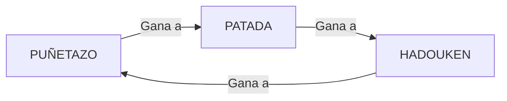

## Práctica de navidades
****

Realizar una aplicación que conste de:
1. Splash screen
2. Pantalla de selección de jugadores
3. Pantalla de juego
4. Dialogos
### Funcionalidad

La aplicación mostrará un recycler view con los datos de los jugadores. Se podrám realizar dos acciones:

1. Al pulsar en la imagen aparecerá un cuadro de diálogo con la información del jugador
2. Al seleccionar dos jugadores (y solo dos) y dar al bóton de lucha saltará un cuadro de diálogo con los dos juagodres vs. Pasados 3 segundos aparecerá la pantalla de batalla

En la pantalla de batalla al pulsar el en botón fight aparecerá un cuadro de diálogo donde se podrá seleccionar una acción (la parte de vs cambia sola). Tras 5 segundo se cierra el cuadro de diálogo y se determina quién ha ganado. Dependiendo del resultado de la lucha (ver reglas) se restará vida y disminuirá la barra de vida

### Reglas

Las opciones de lucha son las siguientes

Se podrán hacer tantos ataques mientras que el tiempo (60 segundos) o las barras de progreso de ambos jugadores no hayan llegado a cero.  Para terminar la partida se pueden dar los siguientes escenarios:

1. El tiempo se ha termiando: Ganará el jugador que más vida le quede
2. Uno de los jugadores ha perdido toda su vida: Ganará el jugador que tenga vida

Cuando se termina la partida saldrá un cuadro de diálogo con el mensaje YOU WIN o YOU LOSE dependiendo del resultado del combate

### Entrega

14 de enero se evaluará en clase la funcionalidad de las prácticas

### Imágenes

      

