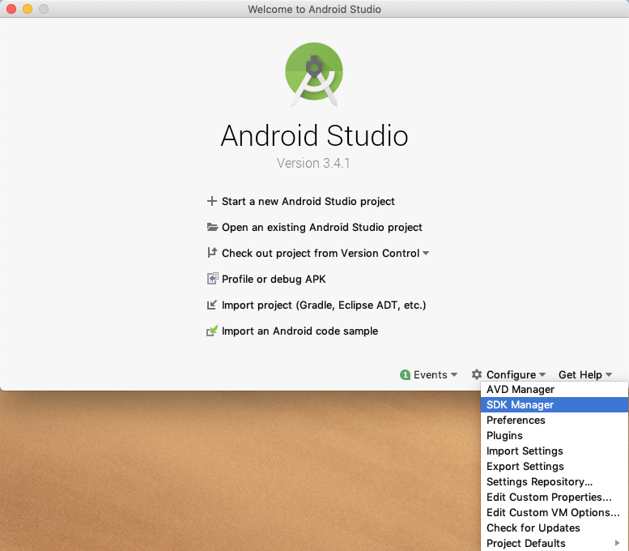
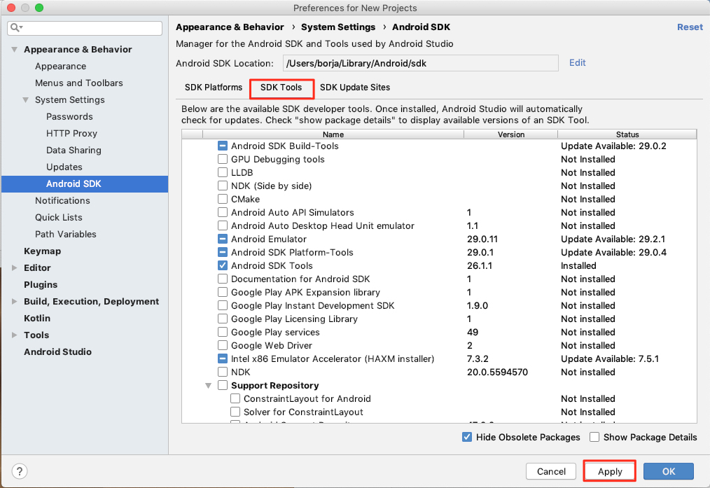
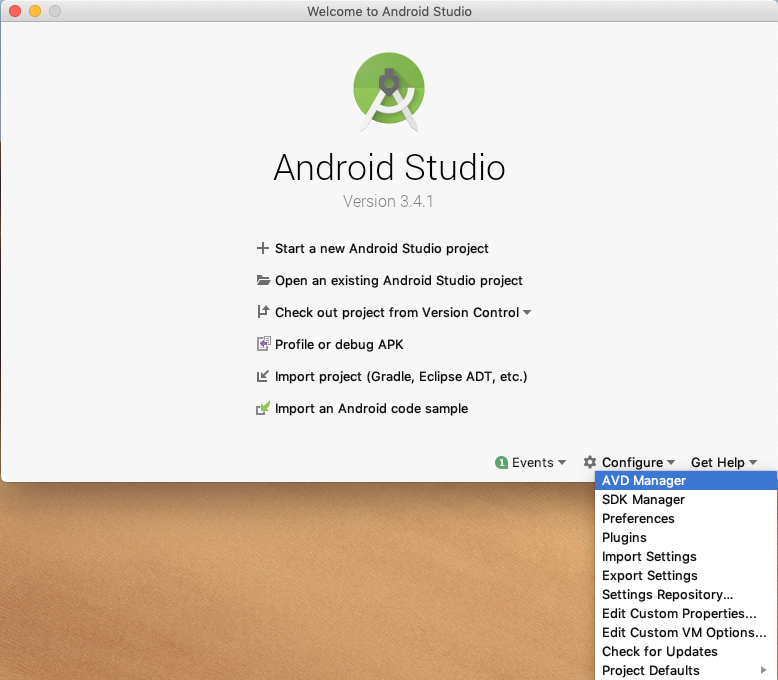
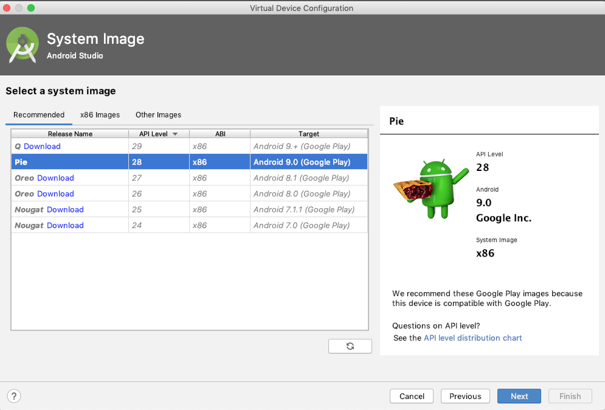

## PMDM

 - [Instalación y configuración](#tema2) 
	 - Instalación SDK, ADB
	 - Creación y administración de AVD e imágenes de SO
	 - Creación proyecto y su estructura bàsica
	 - Depuración en dispositivo virtual y dispositivo físico 
 ****

## Instalación y configuración.
#### [Volver al arriba](#tema2)
***

a.	Configuración del entorno
b.	Configuración de un proyecto y su contenido

- http://www.developandsys.es/estructura-android-studio/
- http://www.developandsys.es/componentes-aplicacion-android/
- http://www.developandsys.es/conceptos-basicos-primera-aplicacion/

c.	Depuración y creación de dispositivos virtuales
d.	Depuración en dispositivo físico

### Instalación de Android Studio u configurar sdk

<a href="https://developer.android.com/studio/install?hl=es-419">Instalar Android studio paso a paso</a>

Una vez instalado hay que configurar y descargar los dk correspondientes para poder trabajar. No es necesario que se descarguen todas las APIs, tan solo con la que se vaya a trabajar. Un nivel recomendado para descargar sería el API 26

Una vez descargada el API, es necesario instalar las herramientas de desarrollo que Android ofrece, para ello se instalan las recomendadas por el IDE

Por último, para poder emular un dispositivo es necesario descargar una imagen del mismo. Para ello se selecciona desde el menú principal la configuración del AVD y se selecciona crear un nuevo dispositivo virtual y se descarga la imagen del sistema operativo API 29

