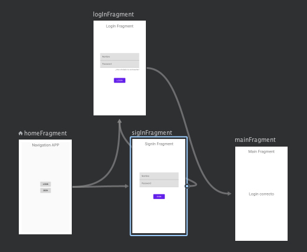

# Navigation component	
Además de la forma tradicional de navegación entre fragments mediante los elementos vistos FramentManager y FragmentTransaction, Android saco un conjunto de librerias llamadas Jetpack que ofrecen la posibilidad de utilizar componentes adicionales que reducen código y mejoran la funcionalidad en algunos aspectos. 

En lo que a manejo de fragment se supone, el componente en cuestion es el Navigation, libreria que permite manejar la redireccion de fragments si necesidad de utilizar el fragment manager ni el fragment transaction. En este caso los elementos básicos que permiten toda la funcionalidad son: 

- Gráfico de navegación: Definido mendiante un archivo xml que permite indicar los fragment existentes y cuales son cada una de las acciones que llevan a otro fragment. Se puede hacer también con activitys, dialogFragment, etc...
- Host: Se trata del elemento gráfico donde se ubicarán los fragmnets que estén definidos en el grafico de navegacion. Este host se define como etiqueta fragment dentro del xml de la activity donde se quiere se aparezcan los fragments
- Controller: Se trata del elemento que posibilita la navegación entre los fragments definidos. Es importante tener en cuenta que la navegación se realiza mediante acciones, no llamando a los fragments como se verá más adelante. 

## Configuraciones necesarias

Antes de empezar con la implementación de la solución propuesta, es necesario traer todas las librerias necesarias para poder funcionar. Por ello se implementarán las siguientes

````
    implementation 'androidx.navigation:navigation-fragment:2.3.5'
    implementation 'androidx.navigation:navigation-ui:2.3.5'
````

Ambas librerias permiten tener disponible todos los elementos que son necesarios para realizar la navegación. 

Para este ejemplo se realizará una aplicación simple de navegacion entre 3 fragments y un cuadre de diálogo. Para ello se cuenta con:

- MainActivity que servirá de base para mostrar los fragments declarados en el gráfico
- HomeFragment: fragment que se mostrará al inicio de la aplicación
- LogInFragmnet: fragment que se mostrará si el usuario pulsa la opcion de LogIn en el fragment de Home
- RegisterFragment: fragment que se mostrará si el usuario pulsa la opcion de SignIn en el fragment de Home
- MainFragment: fragment que se mostrará si el usuario ha metido bien las credenciales en el fragment de LogIn
- DialogUser: dialogFragment que será lanzado solo desde si el usuario ha accedido a la aplicación

Para poder empezar, es necesario plantear cual es la navegación que se quiere dentro de la aplicación. En este caso será la siguiente:


Una vez se tiene claro cual es el flujo de navegación los pasos a seguir son los siguientes

** Para poder realizar todo esto es recomandable que los fragmnents ya estén creados previamente en su parte gráfica ya que la parte lógica se realizará más adelante.


1. Crear el navigation graph

Dentro de la carpeta res se crea un directorio de tipo navegación y dentro de este un archivo de navegación llamado nav_graph. Este archivo tendrá todos los fragment que serán cargados y tendrán la posibilidad de ser navegados desde la activity donde se aplique. Una vez creado el archivo XML se crean lo que se llaman Destination, que son los fragments que se quieren relacionar en un mismo espacio. Cada uno de los fragments creará una etiqueta donde se indica el id del fragment, la etiqueta que se utiliza, el layout que se le aplica y las acciones que se dan. Incialmente el archivo queda de la siguiente forma

````
<?xml version="1.0" encoding="utf-8"?>
<navigation xmlns:android="http://schemas.android.com/apk/res/android"
    xmlns:app="http://schemas.android.com/apk/res-auto"
    xmlns:tools="http://schemas.android.com/tools"
    android:id="@+id/nav_graph"
    app:startDestination="@id/homeFragment">

    <fragment
        android:id="@+id/homeFragment"
        android:name="com.example.navegacionapp.fragments.HomeFragment"
        android:label="HomeFragment"
        tools:layout="@layout/fragment_home">
    </fragment>
    <fragment
        android:id="@+id/logInFragment"
        android:name="com.example.navegacionapp.fragments.LogInFragment"
        android:label="fragment_login"
        tools:layout="@layout/fragment_login" >
    </fragment>
    <fragment
        android:id="@+id/sigInFragment"
        android:name="com.example.navegacionapp.fragments.SigInFragment"
        android:label="fragment_signin"
        tools:layout="@layout/fragment_signin" >
    </fragment>
    <fragment
        android:id="@+id/mainFragment"
        android:name="com.example.navegacionapp.fragments.MainFragment"
        android:label="fragment_main"
        tools:layout="@layout/fragment_main" />
</navigation>
````

Una vez esto está creado, es necesario crear ahora las relaciones entre pantallas. Para ello basta con seleccionar el origen y el destino. En el XML se creará una acción por cada transición con una id (muy importante). El archivo quedará de la siguiente forma



````
<?xml version="1.0" encoding="utf-8"?>
<navigation xmlns:android="http://schemas.android.com/apk/res/android"
    xmlns:app="http://schemas.android.com/apk/res-auto"
    xmlns:tools="http://schemas.android.com/tools"
    android:id="@+id/nav_graph"
    app:startDestination="@id/homeFragment">

    <fragment
        android:id="@+id/homeFragment"
        android:name="com.example.navegacionapp.fragments.HomeFragment"
        android:label="HomeFragment"
        tools:layout="@layout/fragment_home">
        <action
            android:id="@+id/action_homeFragment_to_logInFragment"
            app:destination="@id/logInFragment" />
        <action
            android:id="@+id/action_homeFragment_to_sigInFragment"
            app:destination="@id/sigInFragment" />
    </fragment>
    <fragment
        android:id="@+id/logInFragment"
        android:name="com.example.navegacionapp.fragments.LogInFragment"
        android:label="fragment_login"
        tools:layout="@layout/fragment_login" >
        <action
            android:id="@+id/action_logInFragment_to_mainFragment"
            app:destination="@id/mainFragment" />
    </fragment>
    <fragment
        android:id="@+id/sigInFragment"
        android:name="com.example.navegacionapp.fragments.SigInFragment"
        android:label="fragment_signin"
        tools:layout="@layout/fragment_signin" >
        <action
            android:id="@+id/action_sigInFragment_to_logInFragment"
            app:destination="@id/logInFragment" />
    </fragment>
    <fragment
        android:id="@+id/mainFragment"
        android:name="com.example.navegacionapp.fragments.MainFragment"
        android:label="fragment_main"
        tools:layout="@layout/fragment_main" />
</navigation>
````

2. Crear la dependencia en la activity

En el XML de la Activity donde se van a mostrar los fragments, es necesario montar el sistema que permite mostrarlos  con la posibilidad de navegación que se ha configurado en el nav_graph. Para ello es necesario incluir un elemento de tipo NavHost. En realidad este elemento es una etiqueta fragment que tiene como tipo un NavigationHostFragment. El layout de la activity quedaria de la siguiente forma

````
<?xml version="1.0" encoding="utf-8"?>
<LinearLayout xmlns:android="http://schemas.android.com/apk/res/android"
    xmlns:app="http://schemas.android.com/apk/res-auto"
    xmlns:tools="http://schemas.android.com/tools"
    android:orientation="vertical"
    android:layout_width="match_parent"
    android:layout_height="match_parent"
    tools:context=".MainActivity">


    <fragment
        android:id="@+id/fragment2"
        android:name="androidx.navigation.fragment.NavHostFragment"
        android:layout_width="match_parent"
        android:layout_height="match_parent"
        app:defaultNavHost="true"
        app:navGraph="@navigation/nav_graph" />
    
</LinearLayout>
````

Es importante resaltar varias cosas:

- Es posible introducir más elementos ademas del NavHost como por ejemplo una barra de navegación lateral, menu lateral, toolbar, etc
- El atributo name tiene que tener la clase asociada NavHostFragment
- El atributo defaultNavHost tiene que estar marcado a true para que se pueda identificar que es el elemento principal de navegación
- El atributo navGraph tiene que apuntar al fichero xml que se ha creado en el paso 1. De esta forma el sistema será capaz de interpretar las acciones y los posibles fragments a representar.

3. Dentro de cada uno de los fragments aplicar la ligica de navegación con la pulsación de cada uno de los botones.

Para ello es necesario inicializar cada uno de los botones de los fragments (o los elementos necesarios) para que se puedan dar las acciones. En el caso del fragment home será de la siguiente forma:

````
    public HomeFragment() {
        // Required empty public constructor
    }

    @Override
    public View onCreateView(LayoutInflater inflater, ViewGroup container,
                             Bundle savedInstanceState) {
        // Inflate the layout for this fragment
        return inflater.inflate(R.layout.fragment_home, container, false);
    }

    @Override
    public void onViewCreated(@NonNull View view, @Nullable Bundle savedInstanceState) {
        super.onViewCreated(view, savedInstanceState);
        bLogin = view.findViewById(R.id.boton_login_home);
        bSigIn = view.findViewById(R.id.boton_sigin_home);
        bLogin.setOnClickListener(this);
        bSigIn.setOnClickListener(this);

    }


    @Override
    public void onClick(View v) {
        switch (v.getId()){
            case R.id.boton_login_home:
                Navigation.findNavController(view).navigate(R.id.action_homeFragment_to_logInFragment);
                break;

            case R.id.boton_sigin_home:
                Navigation.findNavController(view).navigate(R.id.action_homeFragment_to_sigInFragment);
                break;
        }
    }
}
```` 

Lo más destaclable de este código es la parte de las acciones OnClick. Para poder navegar simplemente es necesario acceder al componente NavController mediante 

````
 Navigation.findNavController(view)
````

A este método es necesario pasarle la vista. En este caso al tratarse de un fragment tan solo se le pasa el método getView. Una vez accedido al elemento, solo es necesario ejecuatar el método navigate indicandole la acción que se quiere realizar (el id de las acciones que se han declarado en el paso 1)

Por último tan solo quedaría completar el resto de botones y sus acciones en el resto de fragments

````
FragmnetLogIn

    @Override
    public void onViewCreated(@NonNull View view, @Nullable Bundle savedInstanceState) {
        super.onViewCreated(view, savedInstanceState);
        blogIn = getView().findViewById(R.id.boton_login_login);
        blogIn.setOnClickListener(new View.OnClickListener() {
            @Override
            public void onClick(View v) {
                Navigation.findNavController(getView()).navigate(R.id.action_logInFragment_to_mainFragment);
            }
        });
    }
````

````
FragmentSignIn

    @Override
    public void onViewCreated(@NonNull View view, @Nullable Bundle savedInstanceState) {
        super.onViewCreated(view, savedInstanceState);
        bSigIn = getView().findViewById(R.id.boton_sigin_sigin);
        bSigIn.setOnClickListener(new View.OnClickListener() {
            @Override
            public void onClick(View v) {
                Navigation.findNavController(getView()).navigate(R.id.action_sigInFragment_to_logInFragment);
            }
        });
    }

````

## Manejo de la pila

Por defecto cuando se navega a un fragment, se realiza un proceso de reemplazo del fragment anterior por el existente que se carga auntomáticamente en la pila. Este proceso puede ser controlado desde las propidades de las acciones, seleccionando las mismas y modificando los atributos pupUpTo y popUpToInclusive. Vamos a explicar como funcionan ambos atributos:

- En el caso del atributo popUpTo, se indica cual es el fragment que será cargado en el caso de dar al boton de atras (acción de onBackPressed), dejando el resto de la pila descargada. De esta forma si realizamos una navegacion entre diferentes fragment y llegamos a uno que tiene configurado dicho atributo, al dar al boton de atrás se cargará en la pila solo el fragment indicado

- En el caso del atributo popUpTo incluse tiene dos posibilidades. En el caso de configurarlo como true, aunque el atributo popUp esté configurado con algo el fragment actual será el último y al dar al botón atrás se cerrará la aplicación. En el caso de configurarlo como false, se cargará el fragment indicado en el atributo popUp pero no se mantendrá en la pila

Además de este manajo de estado de la pila, se puede controlar las animaciones de entrada y salida de cada uno de las acciones indicando que animación se ejecutaré en cada momento.

## Paso de parámetros

A la hora de realizar el paso de parámetros es muy similar a como se realiza mediante el método tradicional. La diferencia está en que el número de parámetros y el tipo de los mismos debe ir marcado en el grafico de navegación. En cada acción se identifican cuales son los argumentos y de que tipo son. 

````
    <fragment
        android:id="@+id/mainFragment"
        android:name="com.example.navegacionapp.fragments.MainFragment"
        android:label="fragment_main"
        tools:layout="@layout/fragment_main" >
        <argument
            android:name="nombre"
            app:argType="string" />
        <argument
            android:name="pass"
            app:argType="string" />
    </fragment>
````

Un cosa importante es que siempre se definen dentro del fragment destino. En el caso de poder obtener valores nulos también se puede indicar. En la accion se puede indicar valores por defecto en el caso en el que no se pase nada por parámetros. Una vez configurado esto, en el orginen se debe crear un objeto de tipo Bunde donde se incrustan los argumentos con un par clave - valor como ya se explicó en el paso de parámetros tradicional. Por último este objeto de tipo Bundle se incluye en la navegación:

````
    @Override
    public void onViewCreated(@NonNull View view, @Nullable Bundle savedInstanceState) {
        super.onViewCreated(view, savedInstanceState);
        blogIn = getView().findViewById(R.id.boton_login_login);
        editPass = getView().findViewById(R.id.edit_password_login);
        editUser = getView().findViewById(R.id.edit_user_login);
        blogIn.setOnClickListener(new View.OnClickListener() {
            @Override
            public void onClick(View v) {
                String nombre = editUser.getText().toString();
                String pass = editPass.getText().toString();
                Bundle bundle = new Bundle();
                bundle.putString("nombre",nombre);
                bundle.putString("pass",pass);
                Navigation.findNavController(getView()).navigate(R.id.action_logInFragment_to_mainFragment, bundle);
            }
        });
    }
````

Para poder recurperar los elementos en destino y utilizarlos como se quiera, es necesario acceder a los agumentos tal y como se hace de la forma tradicional

````
    @Override
    public void onAttach(@NonNull Context context) {
        super.onAttach(context);
        if (getArguments()!=null){
            nombre = getArguments().getString("nombre");
            pass = getArguments().getString("pass");
        }
    }
````

En este ejemplo se ha realizado desde el método onAttach, pero se puede realizar desde el método que se quiera. 

Adicionalmente, Jetpack ofrece la posibilidad de pasar argumentos de forma más segura (y sencilla) aprovechando lo que se llama save args. Esta funcionalidad se basa en las acciones y argumentos configurados anteriormente en el gráfico de navegación. Para que estos argumentos funcionen es necesario seguir los siguientes pasos

1. Aplicar el pluggin save args dentro del gradle de módulo. Para ello es necesario incluir las siguientes lineas:

````
apply plugin: "androidx.navigation.safeargs"
````

2. Una vez incluido y sincronizado el gradle, es necesario hacer un rebuild del proyecot. Esto detectará cuales son todas las acciones declaradas en el gráfico y los argumentos necesarios entre ellas. Se crearán tantas clases XXXXDirection y XXXXArgs como acciones y argumentos se hayan creado. Estas clases realizan la lógica segura del paso de parámetros que explicamos en el paso tradicional.

3. En la pantalla desde la que se quieren enviar parámetros es necesario utilizar las clases del punto anterior. En este ejemplo se pasan parámetros desde el Fragment LogIn hasta el Fragment Main

````
 blogIn.setOnClickListener(new View.OnClickListener() {
            @Override
            public void onClick(View v) {
                String nombre = editUser.getText().toString();
                 String pass = editPass.getText().toString();
                 /*
                Bundle bundle = new Bundle();
                bundle.putString("nombre",nombre);
                bundle.putString("pass",pass);
Navigation.findNavController(getView()).navigate(R.id.action_logInFragment_to_mainFragment, bundle);*/
                LogInFragmentDirections.ActionLogInFragmentToMainFragment action = LogInFragmentDirections.actionLogInFragmentToMainFragment(nombre,pass);
                Navigation.findNavController(getView()).navigate(action);

            }
        });
````

Las lineas anteriores realizan el paso de parámetrosm indicando los elementos que se quieren pasar utilizando la acción correspondiente

4. Para poder capturar los parámetros en el Fragment destino basta con acceder a la clase Arg creada, mediante el siguiente código:

````
   @Override
    public void onAttach(@NonNull Context context) {
        super.onAttach(context);
        if (getArguments()!=null){
        String nombre = MainFragmentArgs.fromBundle(getArguments()).getNombre();
        String pass = MainFragmentArgs.fromBundle(getArguments()).getPass();
        }
    }
````
 
Con estos pasos los parámetros se pasan entre pantallas de forma más sencilla y segura. 